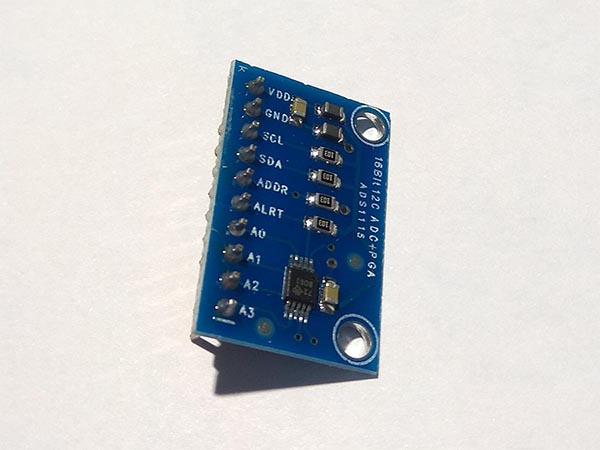
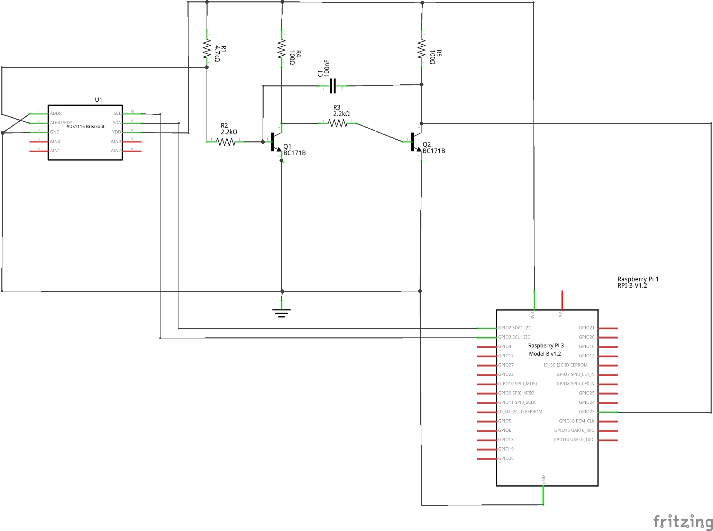
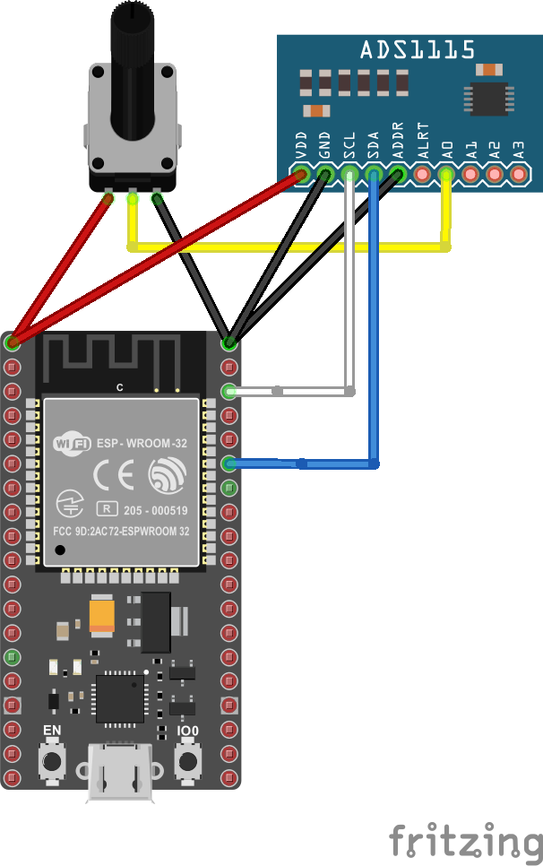
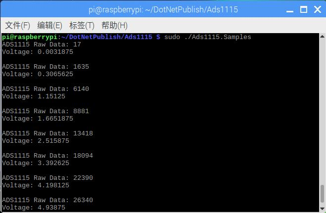
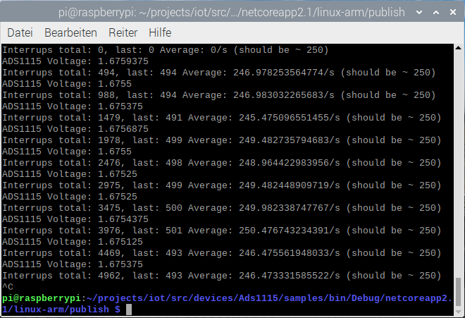

# ADS1115 - Analog to Digital Converter

ADS1115 is an Analog-to-Digital converter (ADC) with 16 bits of resolution.

## Documentation

Prodcut datasheet can be found [here](https://cdn-shop.adafruit.com/datasheets/ads1115.pdf)

## Sensor Image



## Usage

**Important**: make sure you properly setup the I2C pins especially for ESP32 before creating the `I2cDevice`, make sure you install the `nanoFramework.Hardware.ESP32 nuget`:

```csharp
//////////////////////////////////////////////////////////////////////
// when connecting to an ESP32 device, need to configure the I2C GPIOs
// used for the bus
Configuration.SetPinFunction(21, DeviceFunction.I2C1_DATA);
Configuration.SetPinFunction(22, DeviceFunction.I2C1_CLOCK);
```

For other devices like STM32, please make sure you're using the preset pins for the I2C bus you want to use.

```csharp
// set I2C bus ID: 1
// ADS1115 Addr Pin connect to GND
I2cConnectionSettings settings = new I2cConnectionSettings(1, (int)I2cAddress.GND);
I2cDevice device = I2cDevice.Create(settings);

// pass in I2cDevice
// measure the voltage AIN0
// set the maximum range to 6.144V
using (Ads1115 adc = new Ads1115(device, InputMultiplexer.AIN0, MeasuringRange.FS6144))
{
    // read raw data form the sensor
    short raw = adc.ReadRaw();
    // raw data convert to voltage
    double voltage = adc.RawToVoltage(raw);
}
```

See the [samples project](https://github.com/dotnet/iot/tree/main/src/devices/Ads1115/samples) for more examples and usage for different applications.

If you want to use the interrupt pin, the pulses generated by the ADS1115 might be to short to be properly recognized in the software, i.e. on a MCU. The schematic below shows a way of increasing the pulse length so that it is properly recognized (from about 10us to 150us). This uses discrete electronics, but an implementation with an NE555 or equivalent would likely work as well (Just note that you need a type that works at 3.3V).



## Example

### Hardware Required

* ADS1115
* Rotary Potentiometer
* Male/Female Jumper Wires

### Circuit



ADS1115

* ADDR - GND
* SCL - SCL
* SDA - SDA
* VCC - 5V
* GND - GND
* A0 - Rotary Potentiometer Pin 2

Rotary Potentiometer

* Pin 1 - 5V
* Pin 2 - ADS1115 Pin A0
* Pin 3 - GND

### Code

```csharp
// set I2C bus ID: 1
// ADS1115 Addr Pin connect to GND
I2cConnectionSettings settings = new I2cConnectionSettings(1, (int)I2cAddress.GND);
I2cDevice device = I2cDevice.Create(settings);

// pass in I2cDevice
// measure the voltage AIN0
// set the maximum range to 6.144V
using (Ads1115 adc = new Ads1115(device, InputMultiplexer.AIN0, MeasuringRange.FS6144))
{
    // loop
    while (true)
    {
        // read raw data form the sensor
        short raw = adc.ReadRaw();
        // raw data convert to voltage
        double voltage = adc.RawToVoltage(raw);

        Debug.WriteLine($"ADS1115 Raw Data: {raw}");
        Debug.WriteLine($"Voltage: {voltage}");
        Debug.WriteLine();

        // wait for 2s
        Thread.Sleep(2000);
    }
}
```

### Results



