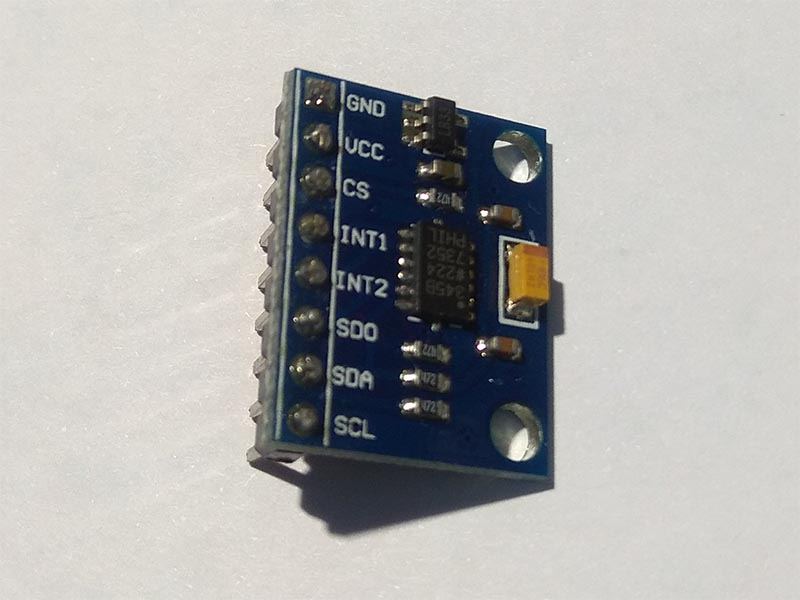
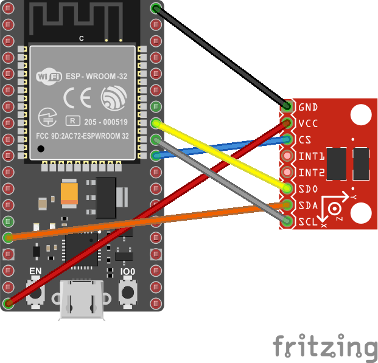
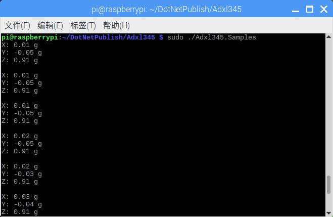

# ADXL345 - Accelerometer

ADXL345 is a small, thin, low power, 3-axis accelerometer with high resolution (13-bit) measurement at up to ±16g.

## Documentation

In [Chinese](http://wenku.baidu.com/view/87a1cf5c312b3169a451a47e.html)

In [English](https://www.analog.com/media/en/technical-documentation/data-sheets/ADXL345.pdf)

## Sensor Image



## Usage

**Important**: make sure you properly setup the SPI pins especially for ESP32 before creating the `SpiDevice`, make sure you install the `nanoFramework.Hardware.ESP32 nuget`:

```csharp
//////////////////////////////////////////////////////////////////////
// when connecting to an ESP32 device, need to configure the SPI GPIOs
// used for the bus
Configuration.SetPinFunction(21, DeviceFunction.SPI1_MOSI);
Configuration.SetPinFunction(22, DeviceFunction.SPI1_MISO);
Configuration.SetPinFunction(23, DeviceFunction.SPI1_CLOCK);
// Make sure as well you are using the right chip select
```

For other devices like STM32, please make sure you're using the preset pins for the SPI bus you want to use. The chip select can as well be pre setup.

```csharp
SpiConnectionSettings settings = new SpiConnectionSettings(1, 42)
{
    ClockFrequency = Adxl345.SpiClockFrequency,
    Mode = Adxl345.SpiMode
};

var device = SpiDevice.Create(settings);

// set gravity measurement range ±4G
using (Adxl345 sensor = new Adxl345(device, GravityRange.Range04))
{
    // read acceleration
    Vector3 data = sensor.Acceleration;

    //use sensor
}
```

## Example

### Hardware Required

* ADXL345
* Male/Female Jumper Wires

## Circuit



* VCC - 3.3 V
* GND -  GND
* CS - CS
* SDO - SPI1 MISO
* SDA - SPI1 MOSI
* SCL - SPI1 SCLK

### Code

```csharp
SpiConnectionSettings settings = new SpiConnectionSettings(1, 42)
{
    ClockFrequency = Adxl345.SpiClockFrequency,
    Mode = Adxl345.SpiMode
};
var device = SpiDevice.Create(settings);

// Set gravity measurement range ±4G
using (Adxl345 sensor = new Adxl345(device, GravityRange.Range04))
{
    // loop
    while (true)
    {
        // read data
        Vector3 data = sensor.Acceleration;

        Debug.WriteLine($"X: {data.X.ToString("0.00")} g");
        Debug.WriteLine($"Y: {data.Y.ToString("0.00")} g");
        Debug.WriteLine($"Z: {data.Z.ToString("0.00")} g");
        Debug.WriteLine();

        // wait for 500ms
        Thread.Sleep(500);
    }
}
```

### Result


