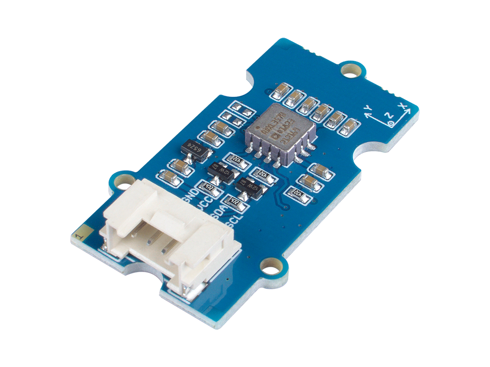

# ADXL357 - Accelerometer

ADXL357 is a 3-Axis digital accelerometer 40g with 20-bit resolution measurement at up to ±40g.
Sensitivity is configurable (±10g, ±20g, ±40g).
Has a built in temperature sensor.

## Documentation

Product documentation can be found [here](https://www.analog.com/en/products/adxl357.html)

## Sensor Image



## Usage

**Important**: make sure you properly setup the I2C pins especially for ESP32 before creating the `I2cDevice`, make sure you install the `nanoFramework.Hardware.ESP32 nuget`:

```csharp
//////////////////////////////////////////////////////////////////////
// when connecting to an ESP32 device, need to configure the I2C GPIOs
// used for the bus
Configuration.SetPinFunction(21, DeviceFunction.I2C1_DATA);
Configuration.SetPinFunction(22, DeviceFunction.I2C1_CLOCK);
```

For other devices like STM32, please make sure you're using the preset pins for the I2C bus you want to use.

```csharp
I2cConnectionSettings i2CConnectionSettings = new I2cConnectionSettings(1, Adxl357.DefaultI2CAddress);
I2cDevice device = I2cDevice.Create(i2CConnectionSettings);
using Adxl357 sensor = new Adxl357(device, AccelerometerRange.Range40G);
int calibrationBufferLength = 10;
int calibrationInterval = 100;
await sensor.CalibrateAccelerationSensor(calibrationBufferLength, calibrationInterval).ConfigureAwait(false);
while (true)
{
    // read data
    Vector3 data = sensor.Acceleration;

    Debug.WriteLine($"X: {data.X.ToString("0.00")} g");
    Debug.WriteLine($"Y: {data.Y.ToString("0.00")} g");
    Debug.WriteLine($"Z: {data.Z.ToString("0.00")} g");
    Debug.WriteLine();

    // wait for 500ms
    Thread.Sleep(500);
}
```
