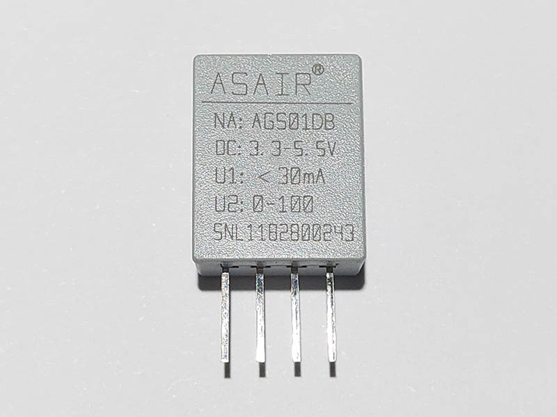
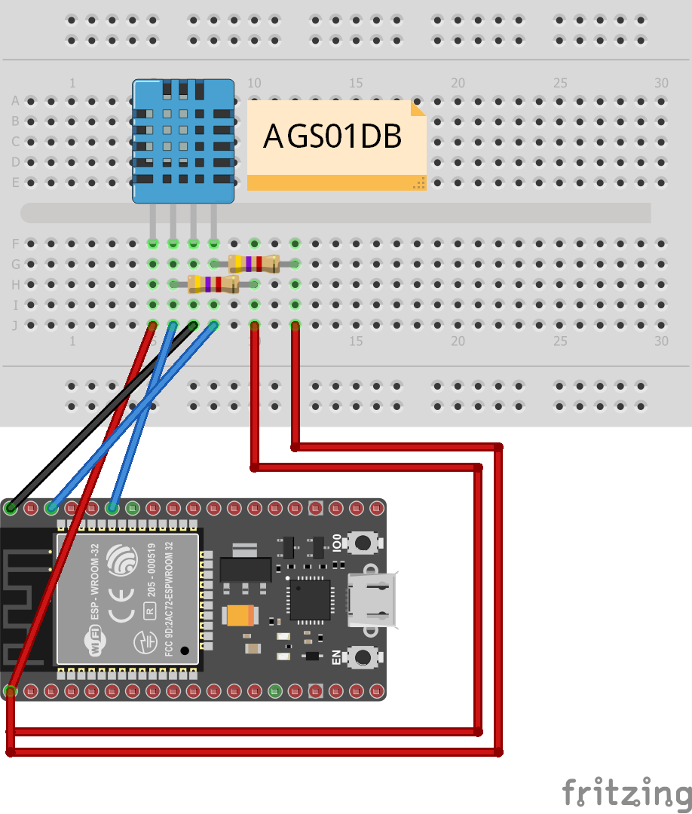
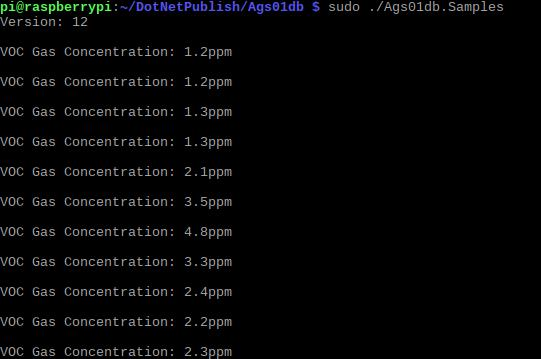

# AGS01DB - MEMS VOC Gas Sensor

AGS01DB is a MEMS VOC gas sensor with calibrated digital signal output. It uses special digital module acquisition technology and gas sensing technology to ensure that the product has high reliability and excellent long-term stability.

## Documentation

Products page in [English](http://www.aosong.com/en/products-33.html)

Datasheet in [Chinese](http://www.aosong.com/userfiles/files/media/AGS01DB%E6%B0%94%E4%BD%93%E4%BC%A0%E6%84%9F%E5%99%A8%E6%A8%A1%E5%9D%97%E8%AF%B4%E6%98%8E%E4%B9%A6V10.pdf)

## Sensor Image



## Usage

**Important**: make sure you properly setup the I2C pins especially for ESP32 before creating the `I2cDevice`, make sure you install the `nanoFramework.Hardware.ESP32 nuget`:

```csharp
//////////////////////////////////////////////////////////////////////
// when connecting to an ESP32 device, need to configure the I2C GPIOs
// used for the bus
Configuration.SetPinFunction(21, DeviceFunction.I2C1_DATA);
Configuration.SetPinFunction(22, DeviceFunction.I2C1_CLOCK);
```

For other devices like STM32, please make sure you're using the preset pins for the I2C bus you want to use.

```csharp
I2cConnectionSettings settings = new I2cConnectionSettings(1, Ags01db.DefaultI2cAddress);
I2cDevice device = I2cDevice.Create(settings);

using (Ags01db sensor = new Ags01db(device))
{
    // read AGS01DB version
    byte version = sensor.Version;

    // read VOC concentration
    double concentration = sensor.Concentration;
}

```

## Example

### Hardware Required

* AGS01DB
* 4.7kΩ resistance × 2
* Male/Female Jumper Wires

### Circuit



* SCL - SCL
* SDA - SDA
* VCC - 5V
* GND - GND

SDA, SCL need pull-up resistance.

### Code

```Csharp
I2cConnectionSettings settings = new I2cConnectionSettings(1, Ags01db.DefaultI2cAddress);
I2cDevice device = I2cDevice.Create(settings);

using (Ags01db sensor = new Ags01db(device))
{
    // read AGS01DB version
    Debug.WriteLine($"Version: {sensor.Version}");
    Debug.WriteLine();

    while (true)
    {
        // read concentration
        Debug.WriteLine($"VOC Gas Concentration: {sensor.Concentration}ppm");
        Debug.WriteLine();

        Thread.Sleep(3000);
    }
}
```

### Result


