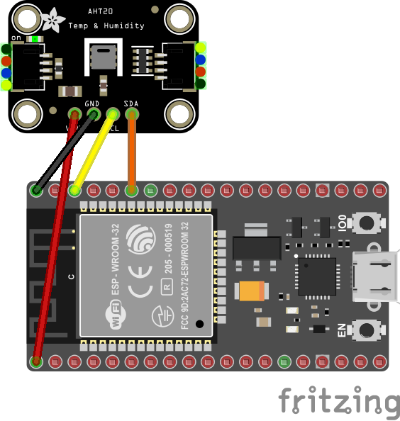

# AHT10/15/20 - Temperature and humidity sensor modules

The AHT10/15 and AHT20 sensors are high-precision, calibrated temperature and relative humidity sensor modules with an I2C digital interface.

## Documentation

### Supported Devices

The binding supports the following types:

* [AHT10](http://www.aosong.com/en/products-40.html)
* [AHT15](http://www.aosong.com/en/products-45.html)
* [AHT20](http://www.aosong.com/en/products-32.html)

### Functions

The binding supports the following sensor functions:

* acquiring the temperature and relative humidty readings
* reading status
* issueing calibration and reset commands

### Sensor classes

You need to choose the class depending on the sensor type.

|Sensor|Required class|
|-----|---------------|
|AHT10|Aht10          |
|Aht15|Aht10          |
|Aht20|Aht20          |

## Usage

**Important**: make sure you properly setup the I2C pins especially for ESP32 before creating the `I2cDevice`, make sure you install the `nanoFramework.Hardware.ESP32 nuget`:

```csharp
//////////////////////////////////////////////////////////////////////
// when connecting to an ESP32 device, need to configure the I2C GPIOs
// used for the bus
Configuration.SetPinFunction(21, DeviceFunction.I2C1_DATA);
Configuration.SetPinFunction(22, DeviceFunction.I2C1_CLOCK);
```

For other devices like STM32, please make sure you're using the preset pins for the I2C bus you want to use.

The binding gets instantiated using an existing `I2cDevice` instance. The AHT-sensor modules support only the default I2C address.

Setup for an AHT20 sensor module:

```csharp
const int I2cBus = 1;
I2cConnectionSettings i2cSettings = new I2cConnectionSettings(I2cBus, Aht20.DefaultI2cAddress);
I2cDevice i2cDevice = I2cDevice.Create(i2cSettings);
Aht20 sensor = new Aht20(i2cDevice);
```

The temperature and humidity readings are acquired by using the following methods:

```csharp
public Temperature GetTemperature()
public Ratio GetHumidity()
```

Refer to the [sample application](https://github.com/dotnet/iot/tree/main/src/devices/Ahtxx/samples) for a complete example.

## Wiring

The AHTxx sensor is wired to the I2C interface (SDC/SDA) of the MCU. The sensor is supplied with 3.3V to comply with the 3.3V interface level of the MCU.


