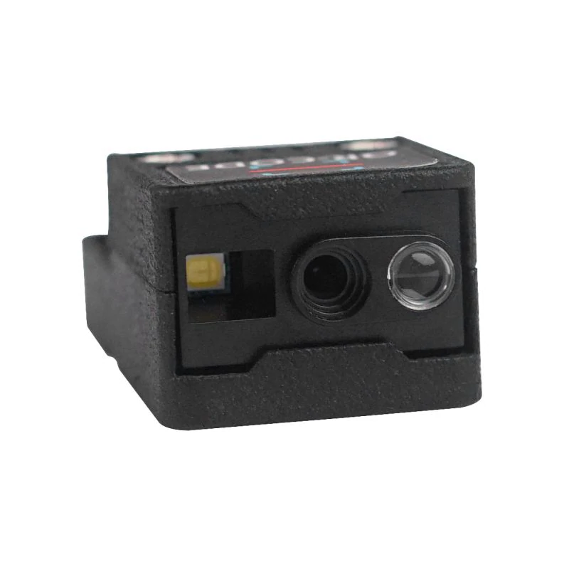

# M5Stack ATOM QR Code reader

This is a library to interact with the ATOM QR Code reader from M5Stack.



## Documentation

* The module documentation can be found [here](https://docs.m5stack.com/en/atom/atomic_qr)

## Usage

**Important**: make sure you properly setup the UART pins for ESP32 before creating the `QrCodeReader`. For this, make sure you install the `nanoFramework.Hardware.ESP32` NuGet:

```csharp
///////////////////////////////////////////////////////////////////////
// when connecting to an ESP32 device, need to configure the UART GPIOs
// the GPIOs below are the ones from the ATOM device that's part of the
// ATOM QR Code reader kit from M5Stack.
Configuration.SetPinFunction(22, DeviceFunction.COM2_RX);
Configuration.SetPinFunction(19, DeviceFunction.COM2_TX);
```

For other devices, like STM32, please make sure you're using the pins for the UART you want to use.

```csharp
using Iot.Device.AtomQrCode;
using nanoFramework.Hardware.Esp32;

// reader is connected to COM2
QrCodeReader reader = new QrCodeReader("COM2");
```

The reader offers various options to work with. Let's explore the most common usage scenarios.

### Reading a barcode

To perform readings "on-demand" the trigger mode has to be set to `Host` and then calling `TryReadBarcode()`.

```csharp
// set scan mode to HOST so it reads on request
reader.TriggerMode = TriggerMode.Host;

// try reading barcode
string code;

if (reader.TryReadBarcode(out code))
{
    Debug.WriteLine(code);
}
else
{
    Debug.WriteLine("*** failed to read barcode ***");
}
```

Upon successful decoding a barcode, it will return the barcode data. On failure an empty string is returned.

### Continuous scanning

For random readings when there is no previous knowledge when there is barcode present (for example on a kiosk) one has to set the trigger mode to `Automatic`, setup an event handler and then call `StartScanning()`.

```csharp
// set scan mode to AUTOSENSING 
reader.TriggerMode = TriggerMode.Autosensing;

// setup handler
reader.BarcodeDataAvailable += Reader_BarcodeDataAvailable;

// start scanning
reader.StartScanning();
```

The scanner will detect changes in the brightness of the surroundings and will trigger a reading when the brightness changes.
Upon successful decoding a barcode, an event is triggered with the barcode data on the respective argument.


```csharp
void Reader_BarcodeDataAvailable(object sender, BarcodeDataAvailableEventArgs e)
{
    Debug.WriteLine("*** barcode data received ***");
    Debug.WriteLine(e.BarcodeData);
}
```

### Settings and configurations

The library exposes several configurations and working options for the reader through properties and commands. Please explore the documentation here.

## Acknowledgments

The development of this library was kindly sponsored by [greenYng](https://greenyng.com/)!


