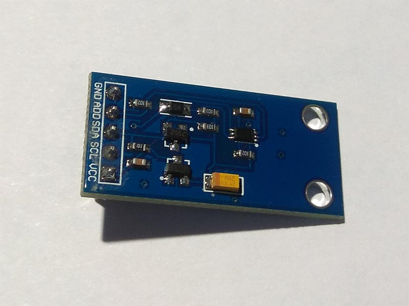
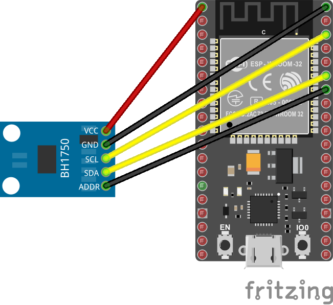
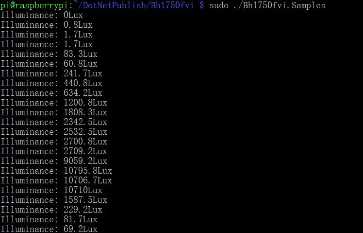

# BH1750FVI - Ambient Light Sensor

BH1750FVI is an digital Ambient Light Sensor IC for I2C bus interface. This IC is the most suitable to obtain the ambient light data for adjusting LCD and Keypad backlight power of Mobile phone. It is possible to detect wide range at High resolution.

## Documentation

Product datasheet can be found [here](https://cdn.datasheetspdf.com/pdf-down/B/H/1/BH1750FVI_Rohm.pdf)

## Sensor Image



## Usage

**Important**: make sure you properly setup the I2C pins especially for ESP32 before creating the `I2cDevice`, make sure you install the `nanoFramework.Hardware.ESP32 nuget`:

```csharp
//////////////////////////////////////////////////////////////////////
// when connecting to an ESP32 device, need to configure the I2C GPIOs
// used for the bus
Configuration.SetPinFunction(21, DeviceFunction.I2C1_DATA);
Configuration.SetPinFunction(22, DeviceFunction.I2C1_CLOCK);
```

For other devices like STM32, please make sure you're using the preset pins for the I2C bus you want to use.

```csharp
I2cConnectionSettings settings = new I2cConnectionSettings(busId: 1, (int)I2cAddress.AddPinLow);
I2cDevice device = I2cDevice.Create(settings);

using (Bh1750fvi sensor = new Bh1750fvi(device))
{
    // read illuminance(Lux)
    double illuminance = sensor.Illuminance;
}

```

## Circuit



* SCL - SCL
* SDA - SDA
* VCC - 5V
* GND - GND
* ADDR - GND

Result of the sample:


