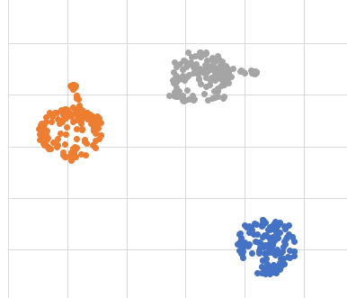
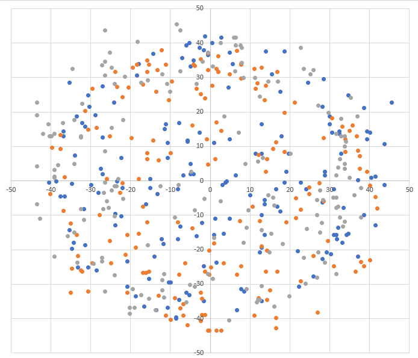
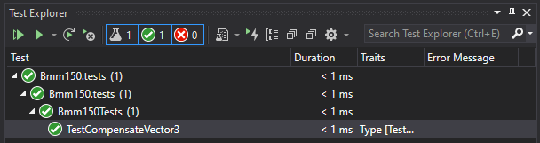

# Bmm150 - Magnetometer

The Bmm150 is a magnetometer that can be controlled either thru I2C either thru SPI. 
This implementation was tested in a ESP32 platform, specificaly in a  [M5Stack Gray](https://shop.m5stack.com/products/grey-development-core).

## Reference

Documentation for the Bmm150 can be [found here](https://www.bosch-sensortec.com/media/boschsensortec/downloads/datasheets/bst-bmm150-ds001.pdf)

## Usage

You can find an example in the [sample](./samples/Bmm150.sample.cs) directory. Usage is straight forward including the possibility to have a calibration.

```csharp
// The I2C pins 21 and 22 in the sample below are ESP32 specific and may differ from other platforms.
// Please double check your device datasheet.
Configuration.SetPinFunction(22, DeviceFunction.I2C1_CLOCK);
Configuration.SetPinFunction(21, DeviceFunction.I2C1_DATA);

I2cConnectionSettings mpui2CConnectionSettingmpus = new(1, Bmm150.DefaultI2cAddress);

using Bmm150 bmm150 = new Bmm150(I2cDevice.Create(mpui2CConnectionSettingmpus));

Debug.WriteLine($"Please move your device in all directions...");

bmm150.CalibrateMagnetometer();

Debug.WriteLine($"Calibration completed.");

while (true)
{
    Vector3 magne = bmm150.ReadMagnetometer(true, TimeSpan.FromMilliseconds(11));

    Debug.WriteLine($"Mag data: X={magne.X,15}, Y={magne.Y,15}, Z={magne.Z,15}");

    Thread.Sleep(100);
}
```
### Expected output

```console
Please move your device in all directions...
Calibration completed.
Mag data: X=    19.79405975, Y=   -38.48844909, Z=   -17.28075408
Mag data: X=     9.16391563, Y=   -25.65896606, Z=   -26.12207031
Mag data: X=     5.49845027, Y=    -4.39876031, Z=   -28.53705596
Mag data: X=     8.79735946, Y=    -3.66556644, Z=   -17.68263244
Mag data: X=    12.82971763, Y=    -4.39876031, Z=   -19.29265785
Mag data: X=    13.92915248, Y=     2.93245315, Z=    -5.22441434
Mag data: X=    14.66280078, Y=    -0.36657002, Z=    -2.81387901
Mag data: X=    12.46315383, Y=    1.099690079, Z=     5.62702512
Mag data: X=    10.63053035, Y=     3.66570019, Z=     6.43172311
Mag data: X=     6.23157691, Y=     0.36656334, Z=     2.81351256
Mag data: X=     3.66549944, Y=              0, Z=      2.8127799
Mag data: X=     2.56589651, Y=              0, Z=     4.42065811
Mag data: X=     0.73312669, Y=    -2.19938015, Z=    6.028955459
```

## Calibration

You can get access perfom calibration thru the ```CalibrateMagnetometer``` function which will. Be aware that the calibration takes a few seconds.

```csharp
bmm150.CalibrateMagnetometer();
```

If no calibration is performed, you will get a raw data cloud which looks like this:



Running the calibration properly require to **move the sensor in all the possible directions** while performing the calibration. You should consider running it with enough samples, at least few hundreds. The default is set to 100. While moving the sensor in all direction, far from any magnetic field, you will get the previous clouds. Calculating the average from those clouds and subtracting it from the read value will give you a centered cloud of data like this:



To create those cloud point graphs, every cloud is a coordinate of X-Y, Y-Z and Z-X. 

Once the calibration is done, you will be able to read the data with the bias corrected using the ```ReadMagnetometer``` function. You will still be able to read the data without any calibration using the ```ReadMagnetometerWithoutCalibration``` function.

## Not supported/implemented features of the Bmm150

* Device Self-Tests
* Device Reset
* Toggle operation modes (defaults to normal mode)


## Testing

Unit tests project is in \Bmm150.tests. You can use VS2019 built-in test capabilites as follows:



```csharp
[TestMethod]
public void TestCompensateVector3()
{
    uint rhall = 42;
    Vector3 rawMagnetormeterData = new Vector3 { X = 13.91375923, Y = -28.74289894, Z = 10.16711997 };
    Bmm150TrimRegisterData trimRegisterData = new Bmm150TrimRegisterData()
    {
        dig_x1 = 0,
        dig_x2 = 26,
        dig_xy1 = 29,
        dig_xy2 = -3,
        dig_xyz1 = 7053,
        dig_y1 = 0,
        dig_y2 = 26,
        dig_z1 = 24747,
        dig_z2 = 763,
        dig_z3 = 0,
        dig_z4 = 0
    };

    double x = Bmm150Compensation.Compensate_x(rawMagnetormeterData.X, rhall, trimRegisterData);
    double y = Bmm150Compensation.Compensate_y(rawMagnetormeterData.Y, rhall, trimRegisterData);
    double z = Bmm150Compensation.Compensate_z(rawMagnetormeterData.Z, rhall, trimRegisterData);

    // Calculated value should be: -1549.91882323
    Assert.Equal(Math.Ceiling(x), Math.Ceiling(-1549.918823), "Unexpected x-axis value.");

    // Calculated value should be: 3201.80615234
    Assert.Equal(Math.Ceiling(y), Math.Ceiling(3201.80615234), "Unexpected y-axis value.");

    // Calculated value should be: 26.20077896
    Assert.Equal(Math.Ceiling(z), Math.Ceiling(26.20077896), "Unexpected z-axis value.");
}
```

