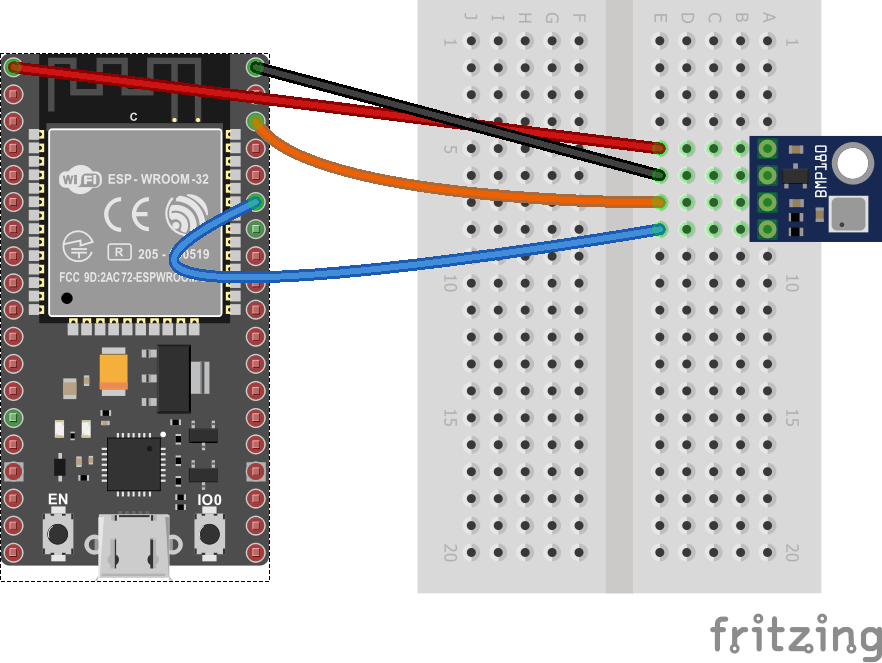

# BMP180 - barometer, altitude and temperature sensor

BMP180 is a device that read barometric pressure, altitude and temperature. I2C can be used to communicate with the device.

## Documentation

[Datasheet](https://cdn-shop.adafruit.com/datasheets/BST-BMP180-DS000-09.pdf) for the BMP180.

## Usage

**Important**: make sure you properly setup the I2C pins especially for ESP32 before creating the `I2cDevice`, make sure you install the `nanoFramework.Hardware.ESP32 nuget`:

```csharp
//////////////////////////////////////////////////////////////////////
// when connecting to an ESP32 device, need to configure the I2C GPIOs
// used for the bus
Configuration.SetPinFunction(21, DeviceFunction.I2C1_DATA);
Configuration.SetPinFunction(22, DeviceFunction.I2C1_CLOCK);
```

For other devices like STM32, please make sure you're using the preset pins for the I2C bus you want to use.

An example on how to use this device binding is available in the [samples](samples) folder.

```csharp
// bus id on the MCU
const int busId = 1;

I2cConnectionSettings i2cSettings = new(busId, Bmp180.DefaultI2cAddress);
using I2cDevice i2cDevice = I2cDevice.Create(i2cSettings);

using Bmp180 i2cBmp280 = new(i2cDevice);
// set samplings
i2cBmp280.SetSampling(Sampling.Standard);

// read values
Temperature tempValue = i2cBmp280.ReadTemperature();
Debug.WriteLine($"Temperature: {tempValue.DegreesCelsius:0.#}\u00B0C");
Pressure preValue = i2cBmp280.ReadPressure();
Debug.WriteLine($"Pressure: {preValue.Hectopascals:0.##}hPa");

// Note that if you already have the pressure value and the temperature, you could also calculate altitude by
// calling WeatherHelper.CalculateAltitude(preValue, Pressure.MeanSeaLevel, tempValue) which would be more performant.
Length altValue = i2cBmp280.ReadAltitude(WeatherHelper.MeanSeaLevel);

Debug.WriteLine($"Altitude: {altValue:0.##}m");
Thread.Sleep(1000);

// set higher sampling
i2cBmp280.SetSampling(Sampling.UltraLowPower);

// read values
tempValue = i2cBmp280.ReadTemperature();
Debug.WriteLine($"Temperature: {tempValue.DegreesCelsius:0.#}\u00B0C");
preValue = i2cBmp280.ReadPressure();
Debug.WriteLine($"Pressure: {preValue.Hectopascals:0.##}hPa");

// Note that if you already have the pressure value and the temperature, you could also calculate altitude by
// calling WeatherHelper.CalculateAltitude(preValue, Pressure.MeanSeaLevel, tempValue) which would be more performant.
altValue = i2cBmp280.ReadAltitude(WeatherHelper.MeanSeaLevel);
Debug.WriteLine($"Altitude: {altValue:0.##}m");
```

The following fritzing diagram illustrates one way to wire up the BMP180 with an MCU like ESP32 using I2C.


