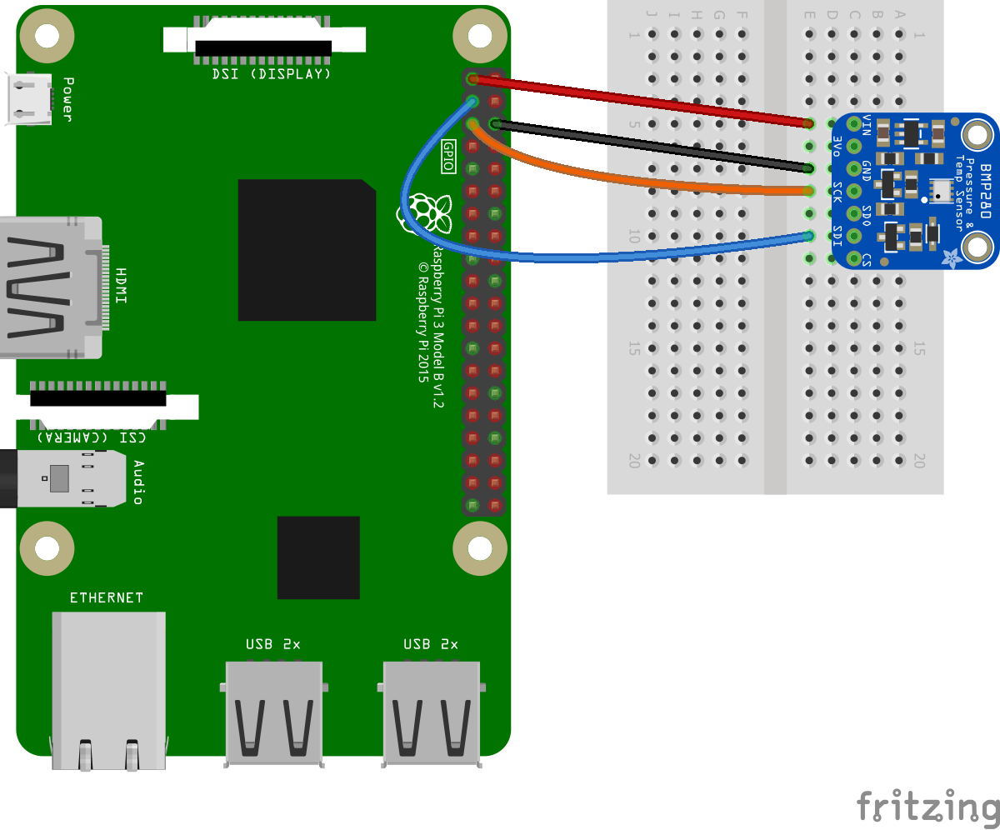

# BMxx80 Device Family

## Summary

BMxx80 is a device family that senses temperature, barometric pressure, altitude, humidity and VOC gas.

SPI and I2C can be used to communicate with the device (only I2C implemented so far).

## Device Family
The implementation supports the following devices:

- BMP280 temperature and barometric pressure sensor ([Datasheet](https://cdn-shop.adafruit.com/datasheets/BST-BMP280-DS001-11.pdf))
- BME280 temperature, barometric pressure and humidity sensor ([Datasheet](https://ae-bst.resource.bosch.com/media/_tech/media/datasheets/BST-BME280-DS002.pdf))
- BME680 temperature, barometric pressure, humidity and VOC gas sensor ([Datasheet](https://ae-bst.resource.bosch.com/media/_tech/media/datasheets/BST-BME680-DS001.pdf))

## Usage

3 examples on how to use this device binding are available in the [samples](samples) folder.

The following fritzing diagram illustrates one way to wire up the BMP280 with an MCU using I2C:



General:

| Bmp280 | MCU |
|--------|:---------:|
|Vin| Power pin|
|GND| Ground|

I2C:

| Bmp280 | MCU |
|--------|:---------:|
|SCK| I2C clock pin|
|SDI| I2C data pin|

### Connection Type

The following connection types are supported by this binding.

- [X] I2C
- [ ] SPI

### I2C bus ID

.NET nanoFramework devices can have multiple I2C buses available. Please check the device pin mapping or use a board support package to address the correct bus when instantiating the `I2cConnectionSettings()`.

### Using on ESP32 devices

To use this binding with an ESP32 device, the following extra steps are required:

1. Add a reference to the [nanoFramework.Hardware.Esp32](https://www.nuget.org/packages/nanoFramework.Hardware.Esp32/) NuGet.
1. Configure the I2C GPIO pins for SDA and SCL. 

For example, to connect to an M5Stack using the side headers, according the the [pin map](https://docs.m5stack.com/en/core/basic) SDA connects to GPIO21 and SCL connects to GPIO22. The code to accomplish this will be:

```csharp
Configuration.SetPinFunction(21, DeviceFunction.I2C1_DATA);
Configuration.SetPinFunction(22, DeviceFunction.I2C1_CLOCK);
```
