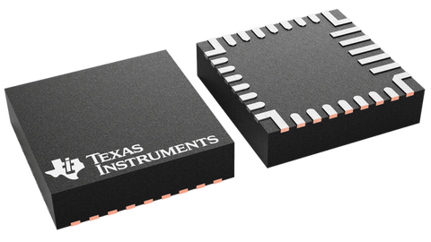
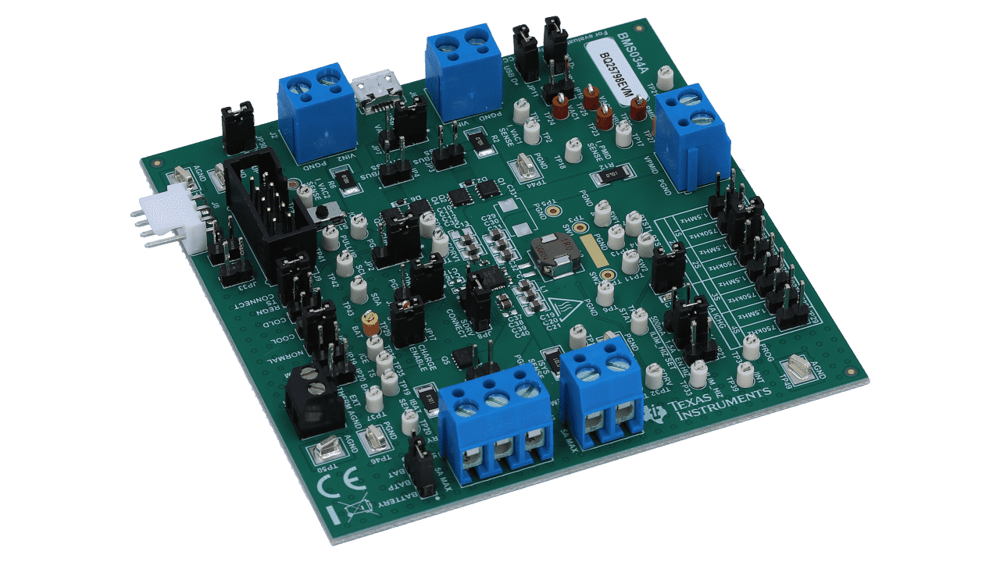

# BQ25798 - Buck-boost solar battery charger

The BQ25798 is a I²C controlled, 1-4-cell, 5-A buck-boost solar battery charger with dual-input selector and MPPT.

## Documentation

- BQ25798 [datasheet](https://www.ti.com/lit/gpn/bq25798)

## Device & EVM

|  |
|:--:|
| VQFN 29 pins chip package |

|  |
|:--:|
| Simplified schematic |

|  |
|:--:|
| Evaluation Module |

## Usage

>**Warning**: If using an ESP32, make sure to properly setup the I2C pins before creating the `I2cDevice`. Add a reference to  `nanoFramework.Hardware.ESP32` NuGet package and add the following code lines:

```csharp
//////////////////////////////////////////////////////////////////////
// when connecting to an ESP32 device, need to configure the I2C GPIOs
// used for the bus
Configuration.SetPinFunction(21, DeviceFunction.I2C1_DATA);
Configuration.SetPinFunction(22, DeviceFunction.I2C1_CLOCK);
```

For other devices like STM32, please make sure you're using the preset pins for the I2C bus you want to use.

### Hardware Required

- BQ25798 EVM
- Male/Female Jumper Wires

### Circuit

- SCL - SCL
- SDA - SDA
- VCC - 5V
- GND - GND

### Code

The following code creates an I2C configuration and instantiates a Bq25798 object. Then it prints the Minimum System Voltage detected by the device at boot. Last it enters a loop where it prints the current Vbus voltage each second.

```csharp
I2cConnectionSettings settings = new I2cConnectionSettings(1, Bq25798.DefaultI2cAddress);
I2cDevice device = I2cDevice.Create(settings);

using (Bq25798 charger = new Bq25798(device))
{
    Debug.WriteLine("");
    Debug.WriteLine($"BQ25798 connected to I2C{device.ConnectionSettings.BusId}");
    Debug.WriteLine("");

    Debug.WriteLine($"Minimum System Voltage is config @ {charger.MinimalSystemVoltage.VoltsDc:N3}V");

    while (true)
    {
        Debug.WriteLine($"Current Vbus: {charger.Vbus.VoltsDc:N3}V");

        Debug.WriteLine("");

        Thread.Sleep(1000);
    }
}
```
