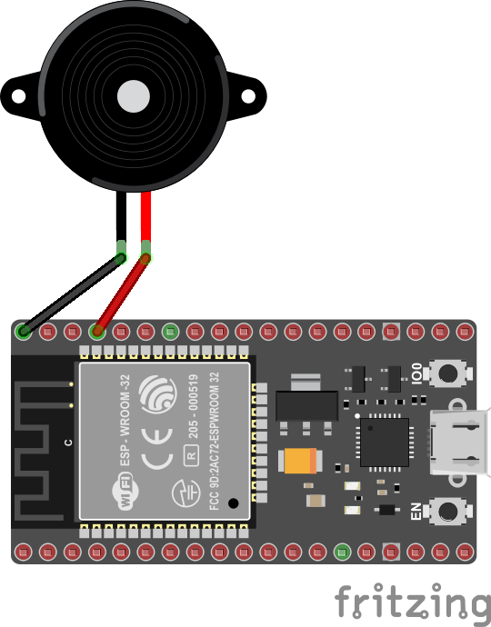

# Buzzer - Piezo Buzzer Controller

This device binding allows playing certain tones using piezo buzzer. It uses PWM with 50% duty cycle and various frequencies.

Piezo buzzers with three pins supported as well as piezo buzzers with two pins.

## Device Family

This binding was tested on two types of piezo buzzers. First type of buzzer has two pins *vcc* and *gnd*. Second type of buzzers has addition *signal* pin.

## Usage

The  `Buzzer`  class can use either software or hardware PWM. This is done fully transparently by the initialization.

If you want to use the software PWM, you have to call the constructor that takes in one integer: `public Buzzer(int pinNumber)`.

To use the hardware PWM, make sure you reference correctly the chip and channel you want to use, and call the constructor that takes two integers (chip and channel).

Also you could explicitly pass a PwmChannel if you want to construct that yourself.

Here's an example how you could use `Buzzer`.

```csharp
using (Buzzer buzzer = new Buzzer(21)); // Initialize buzzer with software PWM connected to pin 21.
{
    buzzer.PlayTone(440, 1000); // Play tone with frequency 440 hertz for one second.
}
```

> **Important** Depending on your platform, you may have to setup the pins properly. In case of ESP32, use the `nanoFramework.Hardware.Esp32` nuget then configure the pin properly like `Configuration.SetPinFunction(21, DeviceFunction.PWM1);`. That should be done before creating the Buzzer. 

`Buzzer` allows to play tone for certain duration like in example above.
Or you could start tone playing, perform some operation and then stop tone playing like in a following example.

```csharp
using (Buzzer buzzer = new Buzzer(21));
{
    buzzer.StartPlaying(440);
    Thread.Sleep(1000);
    buzzer.StopPlaying();
}
```

The result will be the same as in previous example.

`Buzzer` allows you to play only single tone at a single moment. If you will call `SetFrequency` sequentially with a different frequencies then the last call will override previous calls. Following example explains it.

```csharp
using (Buzzer buzzer = new Buzzer(21)); // Initialize buzzer with software PWM connected to pin 21.
{
    buzzer.StartPlaying(440);
    Thread.Sleep(1000);
    buzzer.StartPlaying(880);
    Thread.Sleep(1000);
    buzzer.StopPlaying();
}
```

This example will play tone with frequency 440 for a second and then will play tone with a frequency 880 for a second.

## Example of Alphabet song played using Buzzer

### Schematic

This sample demonstrates using two types of buzzers.
For buzzer with 3 pins: simply connect *signal* pin of buzzer to commutation pin (GPIO26), *vcc* pin to *+5v*, *gnd* pin to ground. For buzzer with 2 pins: connect *vcc* pin of buzzer to commutation pin (GPIO21) and *gnd* to ground.

You could use any types of buzzers in any order. No changes to code are required.



### Code

This sample contains a wrapper on a Buzzer called `MelodyPlayer`.

#### MelodyPlayer and MelodyElement

To create an instance of a MelodyPlayer use following line:

```csharp
MelodyPlayer player = new MelodyPlayer(new  Buzzer(26));
```

Constructor takes a single parameter type of `Buzzer`.

After initialization MelodyPlayer allows playing melody represented by sequence of `MelodyElement` objects.
MelodyElement is a base class for two types of elements:

* `NoteElement` - It will be played. So in a constructor it accepts `Note` and `Octave` to determine frequency of the sound and `Duration` to determine duration of the sound.
* `PauseElement` - It's supposed to make a pause between two NoteElements so it's only have duration of pause as constructor parameter.

#### How to use

Following example demonstrates how to create MelodyElement sequence and how to play it using MelodyPlayer:

```csharp
IList<MelodyElement> sequence = new List<MelodyElement>()
{
    new NoteElement(Note.C, Octave.Fourth, Duration.Quarter),
    new PauseElement(Duration.Quarter),
    new NoteElement(Note.C, Octave.Fourth, Duration.Quarter)
};

using (var player = new MelodyPlayer(new Buzzer(21)))
{
    player.Play(sequence, 100);
}
```

`Play` method MelodyPlayer accepts a sequence of MelodyElements as the first parameter and a tempo as the second.
Tempo is an amount of quarter notes per minute. So the more tempo is the quicker melody will be played.

Also there is an overload of `MelodyPlayer.Play` with 3 parameters: MelodyElement sequence, tempo and transposition value. Transposition increases or decreases every tone of melody sequence by desired amount of semitones. For example: following line will decrease every tone of sequence by one octave since octave consists of 12 semitones.

```csharp
player.Play(sequence, 100, -12);
```

#### Parallel buzzer playing

As far as `MelodyPlayer.Play` method is not asynchronous, calls of this method are wrapped by task like this:

```csharp
using (var player1 = new MelodyPlayer(new Buzzer(21)))
using (var player2 = new MelodyPlayer(new Buzzer(26)))
{
    Task.WaitAll(
        Task.Run(() => player1.Play(AlphabetSong, 100, -12)),
        Task.Run(() => player2.Play(AlphabetSong, 100)));
}
```

This approach allows playing two melodies independently however example above plays a single melody in the same time using two different buzzers.

#### Alphabet song

Presented sample plays Alphabet song using two buzzers. The song is hardcoded in a `Buzzer.Sample.cs` file as a sequence of MelodyElements. Read more about Alphabet song on [Wikipedia](https://en.wikipedia.org/wiki/Alphabet_song)