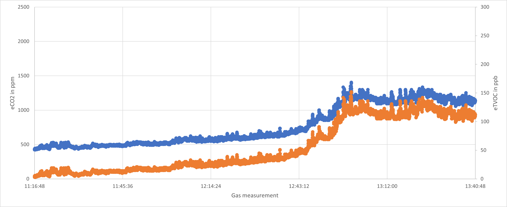
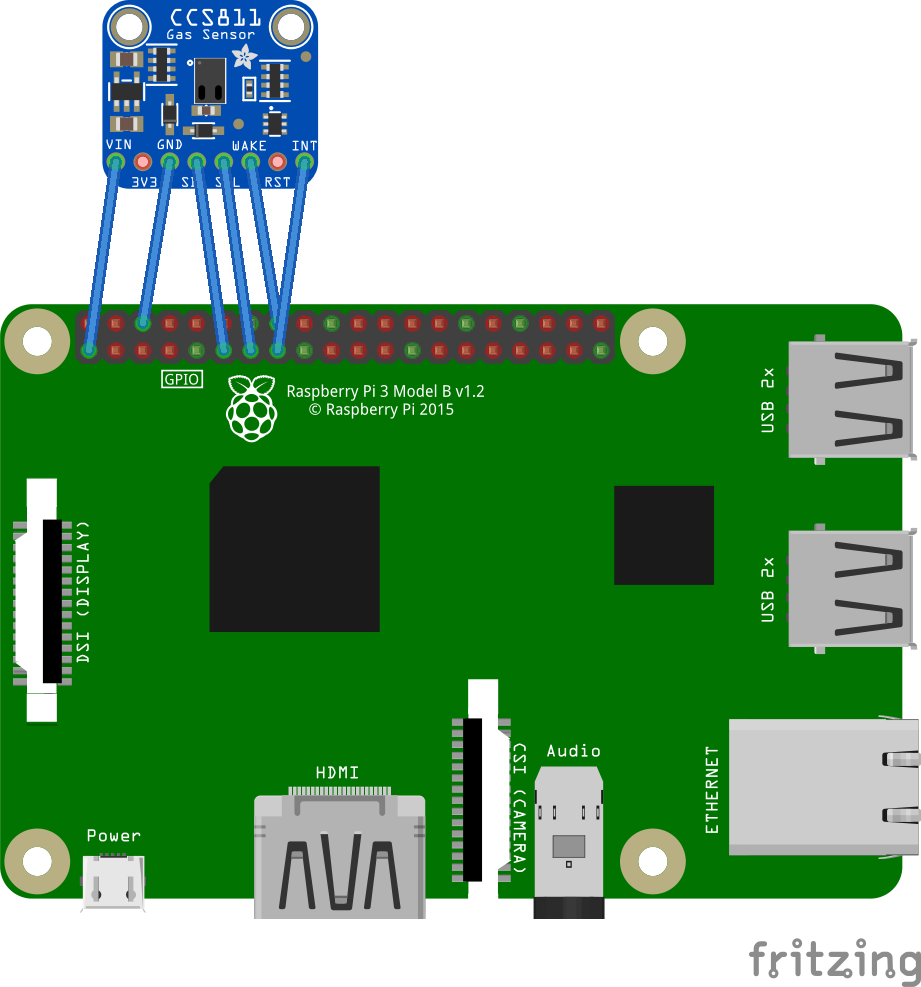

# CCS811 Samples

This sample applicaiton contains flow and menus allowing you to test easilly all the feature of the CSS811 and also show how to implement properly all readings.

You can test it thru a native platform that supports I2C

You can use the native GPIO support for the following pins or not:

- The address pin is used to select primary (0x5A) or secondary (0x5B) I2C device address.
- The Reset pin is sometime present or not. If present and you want to use it, this will perform a full hard reset.
- The Wake pin is used to select the chip and wake it up. If you don't want to use it, just put it to the ground.
- The Interupt pin allows interruption, if used, the interupt mode and events will be activated. This needs to be activated to be able to use the embedded Threshold feature.

You can select any of the mode.

A variety of tests and reading, including changing the temperature and humidity correction is proposed.

You can log the date an nicely import them later on in Excel. The following example shows a measurement over time. In blue, the equivalent CO2 in ppm and in orange the equivalent TVOC in ppb. Note that the measurement started to be accurate around 11:35 on this graph.

# Sample wiring

*Notes*

- This has an impact on the all bus! So if you are using other sensors, this will decrease the speed of all other sensors.
- Even with the bus speed reduced, you may have issues.

