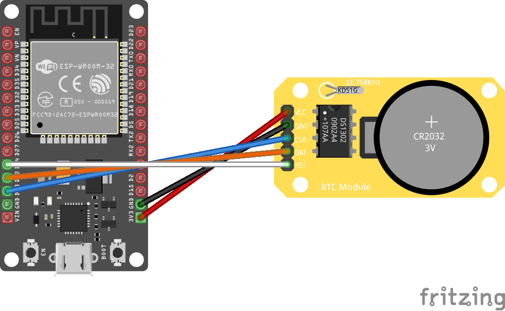

# DS1302 - Realtime Clock
The DS1302 serial real-time clock (RTC) is a lowpower, full binary-coded decimal (BCD) clock/calendar.

[Documentation](https://www.hobbytronics.co.uk/datasheets/DS1302.pdf)

## Sensor Image


## Usage

Connect sensor to the microcontroller.



```csharp
static void GetTimeFromDs1302()
{
    GpioController controller = new GpioController(PinNumberingScheme.Logical);
    using Ds1302 rtc = new(13, 12, 14, controller);

    if (rtc.IsHalted())
    {
        Console.WriteLine("RTC is halted!");
    }
    else
    {
        rtc.Halt();
        Console.WriteLine("RTC was halted now!");
    }

    var currentTime = new DateTime(2022, 8, 5, 18, 31, 0);
    Console.WriteLine(currentTime.ToString());
    rtc.DateTime = currentTime;

    while (true)
    {
        // read time
        DateTime dt = rtc.DateTime;
        Console.WriteLine(dt.ToString("yyyy/MM/dd HH:mm:ss"));
        Thread.Sleep(5000);
    }
}
```
