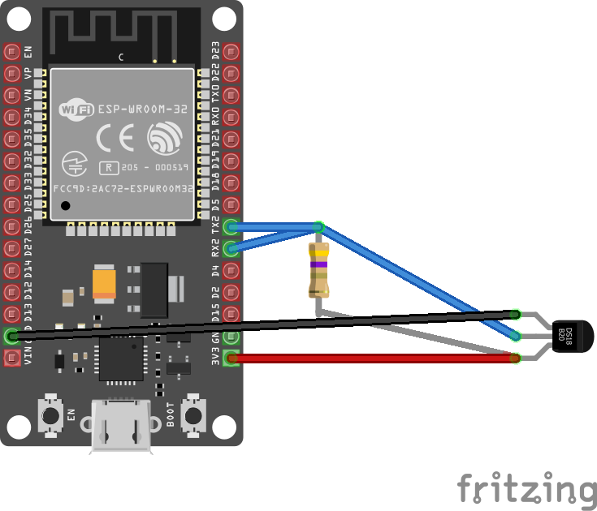

# Ds18b20 - Temperature Sensor

The DS18B20 digital thermometer provides 9-bit to 12-bit Celsius temperature measurements and has an alarm function with nonvolatile user-programmable upper and lower trigger points.

## Documentation

Product datasheet can be found [here](https://datasheets.maximintegrated.com/en/ds/DS18B20.pdf)

## Sensor Image


## Circuit



* DATA - RX2 + TX2 shorted
* VCC - 3.3V
* GND - GND

**Important**: make sure you've connected data pin of sensor to two pins on the board!

## Usage

**Important**: make sure you properly setup the Rx/Tx pins especially for ESP32 before creating the `OneWireHost`, make sure you install the `nanoFramework.Hardware.ESP32 nuget`:

```csharp
Configuration.SetPinFunction(16, DeviceFunction.COM3_RX);
Configuration.SetPinFunction(17, DeviceFunction.COM3_TX);
```

### Library supports three approaches to read the data from Ds18b20 sensors:

1. Reading from first found sensor on OneWire bus or sensor with address passed as second parameter to the constructor:

```csharp
 private static void ReadingFromOneSensor()
 {
     OneWireHost oneWire = new OneWireHost();


     Ds18b20 ds18b20 = new Ds18b20(oneWire, null, false, TemperatureResolution.VeryHigh);

     ds18b20.IsAlarmSearchCommandEnabled = false;
     if (ds18b20.Initialize())
     {
         Console.WriteLine($"Is sensor parasite powered?:{ds18b20.IsParasitePowered}");
         string devAddrStr = "";
         foreach (var addrByte in ds18b20.Address)
         {
             devAddrStr += addrByte.ToString("X2");
         }

         Console.WriteLine($"Sensor address:{devAddrStr}");

         while (true)
         {
             if (!ds18b20.TryReadTemperature(out var currentTemperature))
             {
                 Console.WriteLine("Can't read!");
             }
             else
             {
                 Console.WriteLine($"Temperature: {currentTemperature.DegreesCelsius.ToString("F")}\u00B0C");
             }

             Thread.Sleep(5000);
         }
     }


     oneWire.Dispose();
 }
```

2. Notification mode from first found sensor on OneWire bus or sensor with address passed as second parameter to the constructor:

```csharp
private static void NotificationWhenValueHasChanged()
{
    OneWireHost oneWire = new OneWireHost();

    Ds18b20 ds18b20 = new Ds18b20(oneWire, null, false, TemperatureResolution.VeryHigh);

    if (ds18b20.Initialize())
    {
        ds18b20.SensorValueChanged += (currentTemperature) =>
        {
            Console.WriteLine($"Temperature: {currentTemperature.DegreesCelsius.ToString("F")}\u00B0C");
        };
        ds18b20.BeginTrackChanges(TimeSpan.FromMilliseconds(2000));
        // do whatever you want or sleep
        Thread.Sleep(60000);
        ds18b20.EndTrackChanges();
    }

    oneWire.Dispose();
}
```

3. Using alarms - alarm is a mode when sensor has value either higher or lower than defined tresholds.

```csharp
private static void UsingAlarms()
{
    using OneWireHost oneWire = new OneWireHost();

    Ds18b20 ds18b20 = new Ds18b20(oneWire, null, false, TemperatureResolution.VeryHigh);

    if (ds18b20.Initialize())
    {
        for (int i = 0; i < ds18b20.AddressNet.Length; i++)
        {
            string devAddrStr = "";
            ds18b20.Address = ds18b20.AddressNet[i];

            foreach (var addrByte in ds18b20.AddressNet[i])
            {
                devAddrStr += addrByte.ToString("X2");
            }

            Console.WriteLine("18b20-" + i.ToString("X2") + " " + devAddrStr);

            ds18b20.ConfigurationRead(false);
            Console.WriteLine("Alarm set-points before changes:");
            Console.WriteLine("Hi alarm = " + ds18b20.TemperatureHighAlarm.DegreesCelsius + " C");
            Console.WriteLine("Lo alarm = " + ds18b20.TemperatureLowAlarm.DegreesCelsius + " C");
            SetAlarmSetting();
        }
        alarmSearch();
    }
    else
    {
        Console.WriteLine("No devices found.");
    }

    oneWire.Dispose();

    void alarmSearch()
    {
        int loopRead = 1000;
        ds18b20.IsAlarmSearchCommandEnabled = true;

        while (loopRead > 0)
        {
            Console.WriteLine("LoopRead " + loopRead);

            if (ds18b20.SearchForAlarmCondition())
            {
                for (int index = 0; index < ds18b20.AddressNet.Length; index++)
                {
                    ds18b20.Address = ds18b20.AddressNet[index];
                    if (ds18b20.TryReadTemperature(out var currentTemperature))
                    {
                        break;
                    }

                    string devAddrStr = "";
                    foreach (var addrByte in ds18b20.AddressNet[index]) devAddrStr += addrByte.ToString("X2");
                    Console.WriteLine("DS18B20[" + devAddrStr + "] Sensor reading in One-Shot-mode; T = " + currentTemperature.DegreesCelsius.ToString("f2") + " C");

                    ds18b20.ConfigurationRead(false);
                    Console.WriteLine("Alarm set-points:");
                    Console.WriteLine("Hi alarm = " + ds18b20.TemperatureHighAlarm.DegreesCelsius + " C");
                    Console.WriteLine("Lo alarm = " + ds18b20.TemperatureLowAlarm.DegreesCelsius + " C");
                }
            }
            else
            {
                Console.WriteLine("***** No devices in alarm ****");
            }

            loopRead--;
        }

        Console.WriteLine("");
    }

    void SetAlarmSetting()
    {
        ds18b20.TemperatureHighAlarm = Temperature.FromDegreesCelsius(30);
        ds18b20.TemperatureLowAlarm = Temperature.FromDegreesCelsius(25);
        // Write configuration on ScratchPad.
        ds18b20.ConfigurationWrite(false);
        // Write configuration on EEPROM too.
        ds18b20.ConfigurationWrite(true);
        // Read configuration to check if changes were applied
        ds18b20.ConfigurationRead(true);
        Console.WriteLine("Alarm set-points after changes:");
        Console.WriteLine("Hi alarm = " + ds18b20.TemperatureHighAlarm.DegreesCelsius.ToString("F") + " C");
        Console.WriteLine("Lo alarm = " + ds18b20.TemperatureLowAlarm.DegreesCelsius.ToString("F") + " C");
    }
}
```

Check samples project for more usage examples.