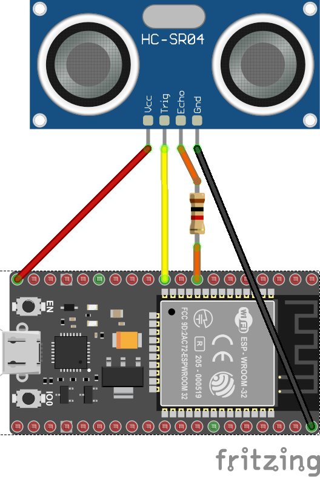

# HC-SR04 - Ultrasonic Ranging Module for ESP32 with RMT

Device bindings for the HC-SR04 sonar distance sensor. Calculates the distance from an object by using the HC-SR04 distance sensor. Specific implementation with ESP32 using RMT. This implementation is more precise than the other generic Hcsr04.

## Documentation

* [HC-SR04 data sheet](https://components101.com/sites/default/files/component_datasheet/HCSR04%20Datasheet.pdf)

## Usage

In most of the cases, you just need to pass the 2 pins you're going to use: the Echo and Trigger pins.

```csharp
using (var sonar = new Hcsr04(4, 17))
{
    if (sonar.TryGetDistance(out Length distance))
    {
        Debug.WriteLine($"Distance: {distance.Centimeters} cm");
    }
    else
    {
        Debug.WriteLine("Error reading sensor");
    }

    Thread.Sleep(1000);
}
```

> Note: it is not possible to use the same pin for both Trigger and Echo.

### Hardware Required

* HC-SR04
* Male/Female Jumper Wires

### Circuit



* VCC - 5V
* GND - GND
* Trig - Any valid GPIO
* Echo - Any valid GPIO

The fritz diagram above depicts how you should wire your MCU in order to run the program, the resistance for R1 is 1kOhm. (Optional). As the HCSR04 works only with 5V and the MCU are mainly 3.3V, this resistor will help protecting the MCU. Check your MCU to see if the pin is 5V tolerant or not.
