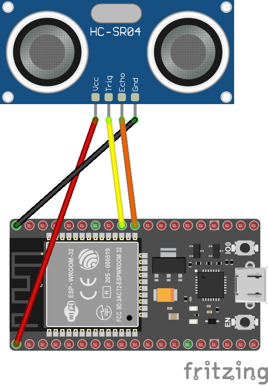

# HC-SR04 - Ultrasonic Ranging Module

Device bindings for the HC-SR04 sonar distance sensor. Calculates the distance from an object by using the HC-SR04 distance sensor.

## Documentation

* [HC-SR04 data sheet](https://components101.com/sites/default/files/component_datasheet/HCSR04%20Datasheet.pdf)

## Usage

```sharp
using (var sonar = new Hcsr04(4, 17))
{
    if (sonar.TryGetDistance(out Length distance))
    {
        Debug.WriteLine($"Distance: {distance.Centimeters} cm");
    }
    else
    {
        Debug.WriteLine("Error reading sensor");
    }

    Thread.Sleep(1000);
}
```

### Hardware Required

* HC-SR04
* Male/Female Jumper Wires

### Circuit



* VCC - 5V
* GND - GND
* Trig - Any valid GPIO
* Echo - Any valid GPIO

The fritz diagram above depicts how you should wire your RPi in order to run the program, the resistance for R1 is 1kOhm. (Optional).
