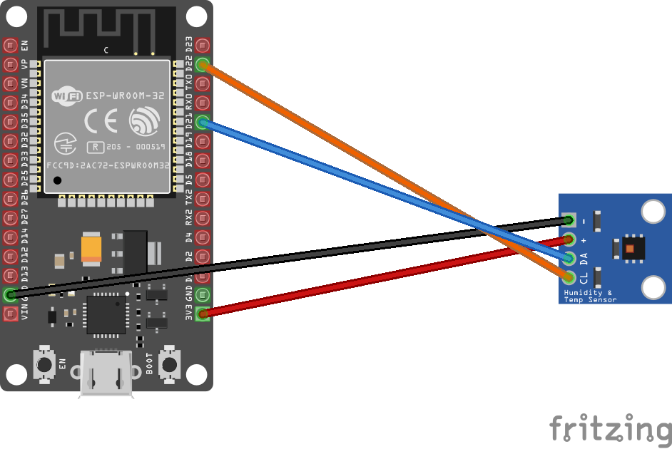

# Hdc1080 - temperature and humidity sensor

Hdc1080 is a device that reads barometric pressure, altitude and temperature. I2C can be used to communicate with the device.

## Documentation

[Datasheet](https://pdf1.alldatasheet.com/datasheet-pdf/view/813671/TI1/HDC1080.html) for the Hdc1080.

## Usage

**Important**: make sure you properly setup the I2C pins especially for ESP32 before creating the `I2cDevice`, make sure you install the `nanoFramework.Hardware.ESP32 nuget`:

```csharp
//////////////////////////////////////////////////////////////////////
// when connecting to an ESP32 device, need to configure the I2C GPIOs
// used for the bus
Configuration.SetPinFunction(21, DeviceFunction.I2C1_DATA);
Configuration.SetPinFunction(22, DeviceFunction.I2C1_CLOCK);
```

For other devices like STM32, please make sure you're using the preset pins for the I2C bus you want to use.

An example on how to use this device binding is available in the [samples](samples) folder.

```csharp
I2cConnectionSettings settings = new I2cConnectionSettings(1, Hdc1080.DefaultI2cAddress, I2cBusSpeed.FastMode);

var tempSensor = new Hdc1080(I2cDevice.Create(settings);
Debug.WriteLine($"SN: {tempSensor.SerialNumber}\r\nDeviceId: {tempSensor.DeviceId}\r\nManufacturerId: {tempSensor.ManufacturerId}");
while (true)
{
    var temperature = tempSensor.ReadTemperature();
    Thread.Sleep(20);
    var humidity = tempSensor.ReadHumidity();
    Debug.WriteLine($"Temperature: {temperature.DegreesCelsius.ToString("F")}\u00B0C Humidity: {humidity.Percent.ToString("F")}%");
    Thread.Sleep(5000);
}
```

The following fritzing diagram illustrates one way to wire up the Hdc1080 sensor with an MCU like ESP32 using I2C.


