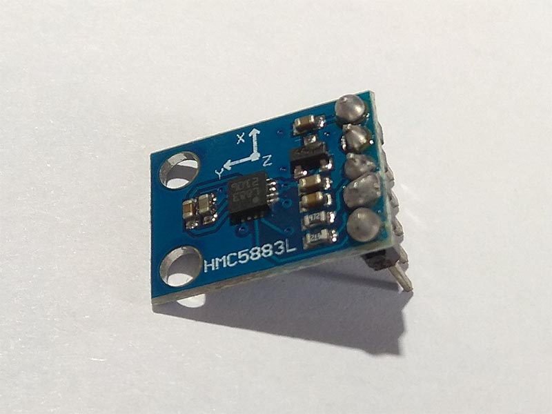
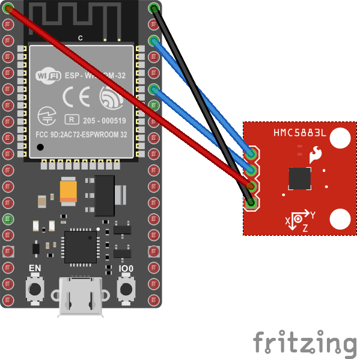
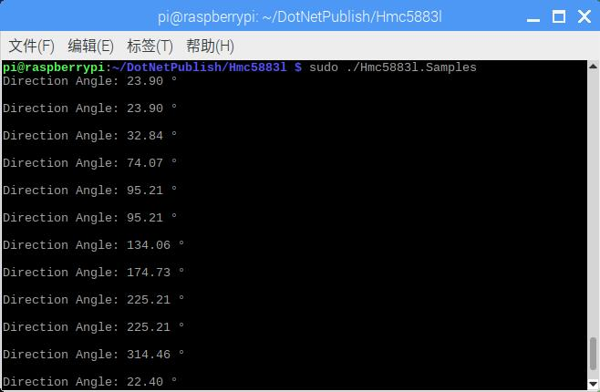

# HMC5883L - 3 Axis Digital Compass

HMC5883L is a surface-mount, multi-chip module designed for low-field magnetic sensing with a digital interface for applications such as lowcost compassing and magnetometry.

## Documentation

- HMC5883L [datasheet](https://cdn.datasheetspdf.com/pdf-down/H/M/C/HMC5883L-Honeywell.pdf)



## Usage

**Important**: make sure you properly setup the I2C pins especially for ESP32 before creating the `I2cDevice`, make sure you install the `nanoFramework.Hardware.ESP32 nuget`:

```csharp
//////////////////////////////////////////////////////////////////////
// when connecting to an ESP32 device, need to configure the I2C GPIOs
// used for the bus
Configuration.SetPinFunction(21, DeviceFunction.I2C1_DATA);
Configuration.SetPinFunction(22, DeviceFunction.I2C1_CLOCK);
```

For other devices like STM32, please make sure you're using the preset pins for the I2C bus you want to use.

```csharp
I2cConnectionSettings settings = new I2cConnectionSettings(1, Hmc5883l.DefaultI2cAddress);
I2cDevice device = I2cDevice.Create(settings);

using (Hmc5883l sensor = new Hmc5883l(device))
{
    // read direction vector
    Vector3 directionVector = sensor.DirectionVector;
    // read heading
    double heading = sensor.Heading;
    // read status
    Status status = sensor.DeviceStatus;
}

```

From the [HMC5883L sample](https://github.com/dotnet/iot/tree/main/src/devices/Hmc5883l/samples), you can go further with the following:

```csharp
I2cConnectionSettings settings = new I2cConnectionSettings(1, Hmc5883l.DefaultI2cAddress);
I2cDevice device = I2cDevice.Create(settings);

using (Hmc5883l sensor = new Hmc5883l(device))
{
    while (true)
    {
        // read heading
        Debug.WriteLine($"Heading: {sensor.Heading.ToString("0.00")} °");
        Debug.WriteLine();

        // wait for a second
        Thread.Sleep(1000);
    }
}
```

### Hardware Required

- HMC5883L
- Male/Female Jumper Wires

### Circuit



- SCL - SCL
- SDA - SDA
- VCC - 5V
- GND - GND

### Result


