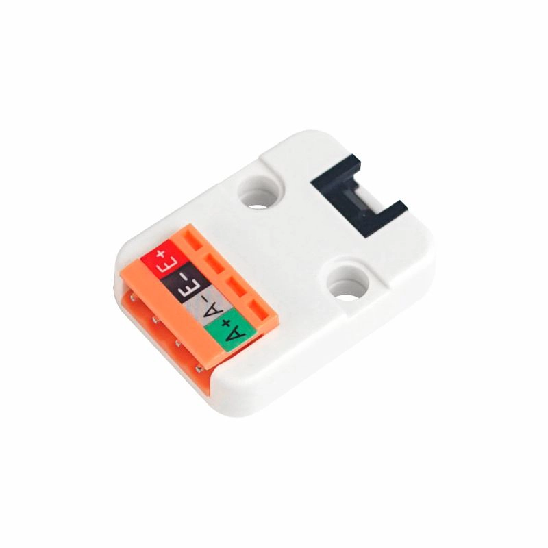

# Hx711 (M5Stack WEIGHT)

This is a library to interact with the Hx711 ADC. This is conveniently assembled and package in the M5Stack WEIGHT module.



## Documentation

* The module documentation can be found [here](https://docs.m5stack.com/en/unit/weight).
* Datasheet for the Hx711 ADC can be found [here](https://m5stack.oss-cn-shenzhen.aliyuncs.com/resource/docs/datasheet/unit/HX711_en.pdf).

## Usage

### Signals and connections

Check the connections for the WEIGTH module at the [product page](https://docs.m5stack.com/en/unit/weight).
From the schematic one can see these signals:

* DOUT: Grove connector pin 1
* PDSCK: Grove connector pin 2

Our code is using SPI to generate the clock signals and read back data from the HX711, so the connections need to match the SPI signals like this:

* MOSI -> PDSCK
* MISO -> DOUT

SPI clock is not used so feel free to route to an unused GPIO.
There is also no need for the CS signal so no need to define a pin for it.

**Important**: make sure you setup the SPI pins for ESP32 before creating the `Scale`. For this, make sure you install the `nanoFramework.Hardware.ESP32` NuGet.

```csharp
///////////////////////////////////////////////////////////////////////
// When connecting to an ESP32 device, need to configure the SPI GPIOs
// The following mapping is used in order to connect the WEIGTH module
// to a M5Core device using the Grove port A
// MOSI: connects to WEIGHT Grove pin 2
// MISO: connects to WEIGHT Grove pin 1
// CLOCK: connect to any free port as it's not used at all
Configuration.SetPinFunction(21, DeviceFunction.SPI1_MOSI);
Configuration.SetPinFunction(22, DeviceFunction.SPI1_MISO);
Configuration.SetPinFunction(23, DeviceFunction.SPI1_CLOCK);
```

> **Warning**
> Make sure to follow the instructions above. At first glance they can look contrary to the naming of the signals and schematics in M5Stack documentation. That's because the GROVE connectors are meant to use I2C and their implementation of the driver is different from ours.

For other devices, like STM32, please make sure you're using the pins for the UART you want to use.

### Configuring SPI

```csharp
// setup SPI connection settings
// the clock value was adjusted in order to get the typical duration expected by the PD_SCK ~1us
var spisettings = new SpiConnectionSettings(1)
{
    ClockFrequency = Scale.DefaultClockFrequency
};

// create SPI device
var spidev = SpiDevice.Create(spisettings);

// create scale
var scale = new Scale(spidev);
```

The scale class is very simple to use and offers some configurations. Let's explore the most common usage scenarios.

### Taring a scale

Taring is used to exclude a measurement from the total weight given by the scale. Most commonly, this function is used to negate the weight of the container or other elements attached to the scale.

```csharp
// set scale tare to get accurate readings
scale.Tare();
```

### Reading the weight

To take a reading of the weight on the load cell just need to call `Read`. The following code snippet will read the weight continuously and output the value to the output pane.

```csharp

// loop forever outputting the current reading
while (true)
{
    var reading = scale.Read();

    Console.WriteLine($"Weight: {reading}");

    Thread.Sleep(2_000);
}
```

### Settings and configurations

The library exposes several configurations. Please explore the documentation here.

## Acknowledgments

The development of this library was kindly sponsored by [greenYng](https://greenyng.com/)!


