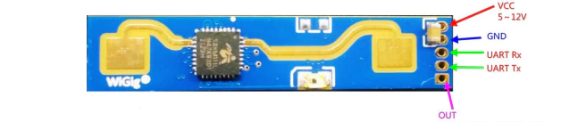

# HLK-LD2410 24Ghz Human Presence Radar Sensor Module

## Documentation

- [Product Page](https://hlktech.net/index.php?id=988)
- [Manual - English](https://make.net.za/wp-content/datasheets/HLK%20LD2410B%20Product%20Manual%20V1.07%20-%20Translated.pdf)
- [Manual - Chinese](https://make.net.za/wp-content/datasheets/HLK%20LD2410B%20Product%20Manual%20V1.07.pdf)
- [Communication Protocol - English](https://make.net.za/wp-content/datasheets/HLK%20LD2410%20Serial%20Communication%20Protocol%20V1.05%20-%20Translated.pdf)
- [Communication Protocol - Chinese](https://make.net.za/wp-content/datasheets/HLK%20LD2410%20Serial%20Communication%20Protocol%20V1.05.pdf)

---



---

## Usage

Initialize the radar module:
```csharp
var radar = new Radar("COM2");
radar.OnMeasurementReceived += OnMeasurement;
radar.Connect();
```

The `OnMeasurement` event handler is responsible for receiving measurement reports from the radar. The report object instance contains distance and energy measurements for targets within the detection range of the radar.

An example on how to print out some of this data to the console through the event handler:
```csharp
private static void OnMeasurement(object sender, ReportFrame e)
{
    if (e is EngineeringModeReportFrame engineeringModeReportFrame)
    {
        Debug.WriteLine($"Target State (Engineering Mode): {engineeringModeReportFrame.TargetState} | Movement Target Distance (CM): {engineeringModeReportFrame.MovementTargetDistance.Centimeters} | " +
            $"Movement Target Energy: {engineeringModeReportFrame.MovementTargetEnergy} | Stationary Target Distance (CM): {engineeringModeReportFrame.StationaryTargetDistance.Centimeters} | " +
            $"Stationary Target Energy: {engineeringModeReportFrame.StationaryTargetEnergy} | Detection Distance (CM): {engineeringModeReportFrame.DetectionDistance.Centimeters}");

        var gateNumber = 0;
        foreach (var gate in engineeringModeReportFrame.GateData)
        {
            Debug.WriteLine($"Gate: {gateNumber} - Movement Energy: {gate.MovementEnergy} - Static Energy: {gate.StaticEnergy}");
            gateNumber++;
        }
    }
    else if (e is BasicReportFrame basicReportFrame)
    {
        Debug.WriteLine($"Target State: {basicReportFrame.TargetState} | Movement Target Distance (CM): {basicReportFrame.MovementTargetDistance.Centimeters} | " +
            $"Movement Target Energy: {basicReportFrame.MovementTargetEnergy} | Stationary Target Distance (CM): {basicReportFrame.StationaryTargetDistance.Centimeters} | " +
            $"Stationary Target Energy: {basicReportFrame.StationaryTargetEnergy} | Detection Distance (CM): {basicReportFrame.DetectionDistance.Centimeters}");
    }
}
```

Calling `Connect()` on an instance of the radar object will initialize a new `SerialPort` (or use the `SerialPort` instance passed to the `Radar` constructor) and open a serial connection with the radar module. The radar will immediately start reporting measurements which are received in the event handler detailed above.

Issuing commands to the radar to read or change configurations requires the radar to be put into `Configuration` mode. This can be achieved by calling `Radar.EnterConfigurationMode()`. The following example shows how to enable the engineering mode on the radar to receive target energy levels at every supported distance gate:

```csharp
radar.EnterConfigurationMode();
radar.SetEngineeringMode(true);
radar.ExitConfigurationMode();
```

Additionally, when `Radar.Connect()` is executed successfully, the `Radar` class will read the current configurations stored on the module. This data will be available through `Radar.Configuration` and `Radar.FirmwareVersion`.

To change the configuration on the radar, make the changes directly to `Radar.Configuration` and then call `Radar.CommitConfigurations()` to store them on the radar module.

The radar module can be restored to factory settings using `Radar.RestoreFactorySettings()` and restarted (power-cycled) using `Radar.Restart()`.

For more information on what this radar can do, please refer to the documentation listed above.
