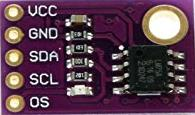
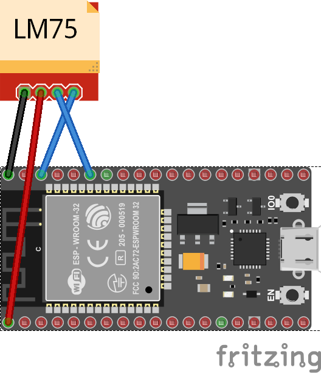
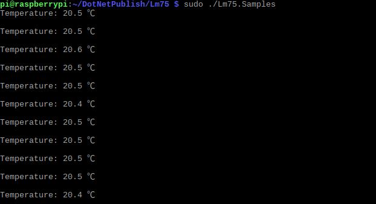

# LM75 - Digital Temperature Sensor

The LM75 is a temperature sensor, Delta-Sigma analog-to-digital converter, and digital over-temperature detector with I2C interface.

## Documentation

- LM75 [datasheet](https://cdn.datasheetspdf.com/pdf-down/L/M/7/LM75_NationalSemiconductor.pdf)



## Usage

**Important**: make sure you properly setup the I2C pins especially for ESP32 before creating the `I2cDevice`, make sure you install the `nanoFramework.Hardware.ESP32 nuget`:

```csharp
//////////////////////////////////////////////////////////////////////
// when connecting to an ESP32 device, need to configure the I2C GPIOs
// used for the bus
Configuration.SetPinFunction(21, DeviceFunction.I2C1_DATA);
Configuration.SetPinFunction(22, DeviceFunction.I2C1_CLOCK);
```

For other devices like STM32, please make sure you're using the preset pins for the I2C bus you want to use.

```csharp
I2cConnectionSettings settings = new I2cConnectionSettings(1, Lm75.DefaultI2cAddress);
I2cDevice device = I2cDevice.Create(settings);

using(Lm75 sensor = new Lm75(device))
{
    double temperature = sensor.Temperature.Celsius;
}
```

## LM75 Example

### Circuit



- SCL - SCL
- SDA - SDA
- VCC - 5V
- GND - GND

### Code

```csharp
I2cConnectionSettings settings = new I2cConnectionSettings(1, Lm75.DefaultI2cAddress);
I2cDevice device = I2cDevice.Create(settings);

using(Lm75 sensor = new Lm75(device))
{
    while (true)
    {
        Debug.WriteLine($"Temperature: {sensor.Temperature.Celsius} ℃");
        Debug.WriteLine();

        Thread.Sleep(1000);
    }
}
```

### Result


