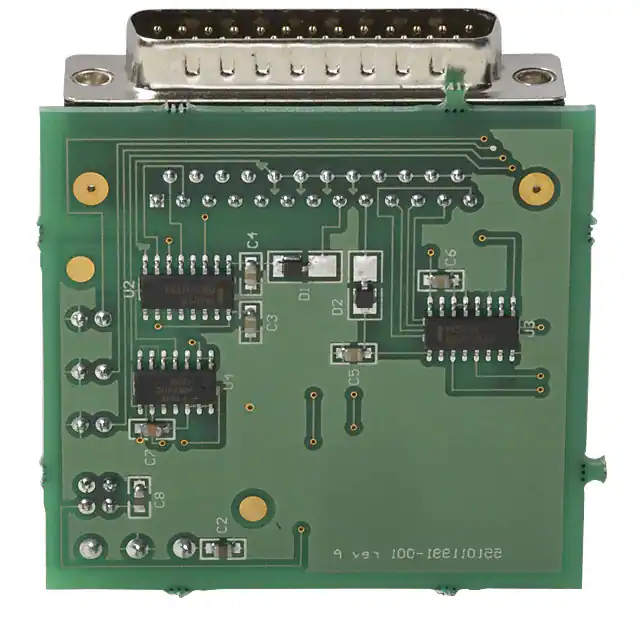
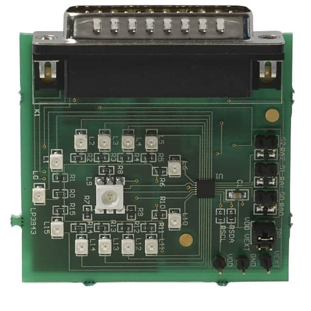

# Lp3943 LED driver

The LP3943 is an integrated device capable of independently driving 16 LEDs. It uses I2C.

## Documentation

- Lp3943 [datasheet](https://www.ti.com/lit/ds/symlink/lp3943.pdf)




## Usage

**Important**: make sure you properly setup the I2C pins especially for ESP32 before creating the `I2cDevice`, make sure you install the `nanoFramework.Hardware.ESP32 nuget`:

```csharp
//////////////////////////////////////////////////////////////////////
// when connecting to an ESP32 device, need to configure the I2C GPIOs
// used for the bus
Configuration.SetPinFunction(21, DeviceFunction.I2C1_DATA);
Configuration.SetPinFunction(22, DeviceFunction.I2C1_CLOCK);
```

For other devices like STM32, please make sure you're using the preset pins for the I2C bus you want to use.

```csharp
I2cConnectionSettings settings = new I2cConnectionSettings(1, Lp3943.DefaultI2cAddress);
I2cDevice device = I2cDevice.Create(settings);

using var ledDriver = new Lp3943(device, resetPin);

// Dim LEDs 0 to 7 at 1 Hz at 25% duty cycle
ledDriver.DimRegister(DimRegister.Dim0, 1, 25);

// Dim LEDs 8 to 15 at 5 Hz at 50% duty cycle
ledDriver.DimRegister(DimRegister.Dim1, 5, 50);

// Set LEDs 12, 13, 14, 15 off
ledDriver.SetLed(
	new[] { 12, 13, 14, 15 },
	LedState.Off
);

// Set LEDs 0, 1, 2, 3, 4, 5 on
ledDriver.SetLed(
	new[] { 0, 1, 2, 3, 4, 5 },
	LedState.On
);

// Set LEDs 6, 7, 8 to be powered by Dim register 0
ledDriver.SetLed(
	new[] { 6, 7, 8 },
	LedState.Dim0
);

// Set LEDs 9, 10, 11 to be powered by Dim register 1
ledDriver.SetLed(9, LedState.Dim1);
ledDriver.SetLed(10, LedState.Dim1);
ledDriver.SetLed(11, LedState.Dim1);
```
