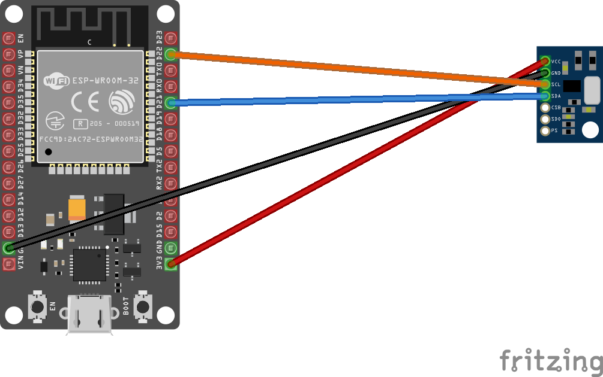

# Ms5611 in GY-63 module - temperature and pressure sensor

Ms5611 is a device that reads barometric pressure, altitude and temperature. I2C can be used to communicate with the device.

## Documentation

[Datasheet](https://datasheetspdf.com/pdf-file/921406/measurement/MS5611-01BA03/1) for the Ms5611.

## Usage

**Important**: make sure you properly setup the I2C pins especially for ESP32 before creating the `I2cDevice`, make sure you install the `nanoFramework.Hardware.ESP32 nuget`:

```csharp
//////////////////////////////////////////////////////////////////////
// when connecting to an ESP32 device, need to configure the I2C GPIOs
// used for the bus
Configuration.SetPinFunction(21, DeviceFunction.I2C1_DATA);
Configuration.SetPinFunction(22, DeviceFunction.I2C1_CLOCK);
```

For other devices like STM32, please make sure you're using the preset pins for the I2C bus you want to use.

An example on how to use this device binding is available in the [samples](samples) folder.

```csharp
//Czestochowa, Poland ,3rd floor
double altitude = 250;
// bus id on the MCU
const int busId = 1;
I2cConnectionSettings i2cSettings = new(busId, Ms5611.DefaultI2cAddress);
using I2cDevice i2cDevice = I2cDevice.Create(i2cSettings);
var sensor = new Ms5611(i2cDevice, Sampling.Standard);

while (true)
{
    var temp = sensor.ReadTrueTemperature();
    var temperature = sensor.ReadTemperature();
    var pressure = sensor.ReadSeaLevelPressure(Length.From(altitude, LengthUnit.Meter));
    Debug.WriteLine($"Temperature: {temperature.DegreesCelsius.ToString("F")}\u00B0C, Pressure: {pressure.Hectopascals.ToString("F")}hPa");
    Thread.Sleep(5000);
}
```

The following fritzing diagram illustrates one way to wire up the GY-63 module with an MCU like ESP32 using I2C.



SPI implementation hasn't been done.
