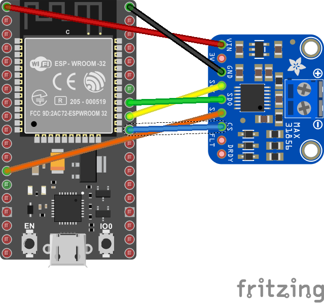

# Max31856 - cold-junction compensated thermocouple to digital converter

The Max31856 device is a SPI interface cold-junction compensated thermocouple to digital converter.



**Note:** _ThermocoupleType.K is configured for a K type thermocouple if you want to use a B,E,J,K,N,R,S, or T simply change the K to the thermocouple type of your choosing._

## Documentation

* Max31856 [datasheet](https://datasheets.maximintegrated.com/en/ds/Max31856.pdf)

## Usage

**Important**: make sure you properly setup the SPI pins especially for ESP32 before creating the `SpiDevice`, make sure you install the `nanoFramework.Hardware.ESP32 nuget`:

```csharp
//////////////////////////////////////////////////////////////////////
// when connecting to an ESP32 device, need to configure the SPI GPIOs
// used for the bus
Configuration.SetPinFunction(21, DeviceFunction.SPI1_MOSI);
Configuration.SetPinFunction(22, DeviceFunction.SPI1_MISO);
Configuration.SetPinFunction(23, DeviceFunction.SPI1_CLOCK);
// Make sure as well you are using the right chip select
```

For other devices like STM32, please make sure you're using the preset pins for the SPI bus you want to use. The chip select can as well be pre setup.

The Max31856.samples file contains a sample usage of the device. Note that this reads two temperatures. One is a connected thermocouple reading which can be read using the  ```TryGetTemperature``` command and the other is the temperature of the device itself which can be read using the ```GetColdJunctionTemperature``` command. The Cold Junction Temperature is used internally to increase the accuracy of the thermocouple but can also be read if you find a use for it.

Create a new ```SpiConnectionSettings``` Class if using a MCU do not change these settings.

```csharp
SpiConnectionSettings settings = new(1, 42)
{
    ClockFrequency = Max31856.SpiClockFrequency,
    Mode = Max31856.SpiMode,
    DataFlow = 0
};
```

Create a new ```SpiDevice``` with the settings from above. Then create a new Max31856 device with the ```SpiDevice``` as well as the correct ```ThermocoupleType``` (see note below)

```csharp
using SpiDevice device = SpiDevice.Create(settings);
using Max31856 sensor = new(device, ThermocoupleType.K);
```

Now read the temperature from the device. Using the UnitsNet nuget you can see the units of your choosing. In this example you chan change```DegreesFahrenheit``` to ```DegreesCelsius``` or any other unit by changing ```.GetTemperature().DegreesFahrenheit``` to another unit of your choice.

```csharp
while (true)
{
    Temperature tempColdJunction = sensor.GetColdJunctionTemperature();
    Debug.WriteLine($"Temperature: {tempColdJunction.DegreesCelcius} ℃");
    Thread.Sleep(2000);
}
```
