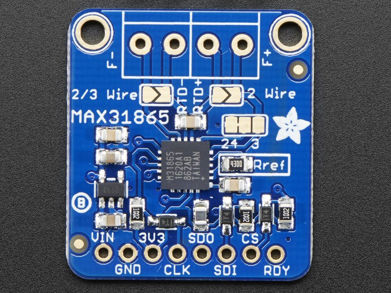
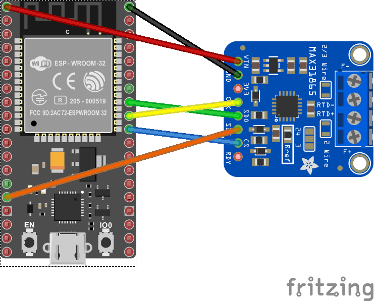

# MAX31865 - Resistance Temperature Detector Amplifier

The MAX31865 device is a SPI interface Resistance Temperature Detector to Digital Converter.



## Documentation

* MAX31865 [datasheet](https://datasheets.maximintegrated.com/en/ds/MAX31865.pdf)

## Usage

**Important**: make sure you properly setup the SPI pins especially for ESP32 before creating the `SpiDevice`, make sure you install the `nanoFramework.Hardware.ESP32 nuget`:

```csharp
//////////////////////////////////////////////////////////////////////
// when connecting to an ESP32 device, need to configure the SPI GPIOs
// used for the bus
Configuration.SetPinFunction(21, DeviceFunction.SPI1_MOSI);
Configuration.SetPinFunction(22, DeviceFunction.SPI1_MISO);
Configuration.SetPinFunction(23, DeviceFunction.SPI1_CLOCK);
// Make sure as well you are using the right chip select
```

For other devices like STM32, please make sure you're using the preset pins for the SPI bus you want to use. The chip select can as well be pre setup.

```csharp
SpiConnectionSettings settings = new(1, 42)
{
    ClockFrequency = Max31865.SpiClockFrequency,
    Mode = Max31865.SpiMode1,
    DataFlow = Max31865.SpiDataFlow
};

using SpiDevice device = SpiDevice.Create(settings);
using Max31865 sensor = new(device, PlatinumResistanceThermometerType.PT1000, ResistanceTemperatureDetectorWires.ThreeWire, ElectricResistance.FromOhms(4300));

while (true)
{
    Debug.WriteLine($"Temperature: {sensor.Temperature.DegreesCelsius} ℃");

    // wait for 2000ms
    Thread.Sleep(2000);
}
```

**Note:** _You can use any PT100 or PT1000 temperature sensor which has 2/3/4 wires._

## Hardware Required

* MAX31865
* Male/Female Jumper Wires

## Circuit

The following fritzing diagram illustrates one way to wire up the MAX31865 Resistance Temperature Detector to Digital Converter with a MCU



* SDI - MOSI
* SDO - MISO
* CLK - SCLK
* CS  - CE0
* VIN - 3V
* GND - GND

## Known limitations

This version only performs the one shot temperature conversion and not the continuous temperature conversion.
