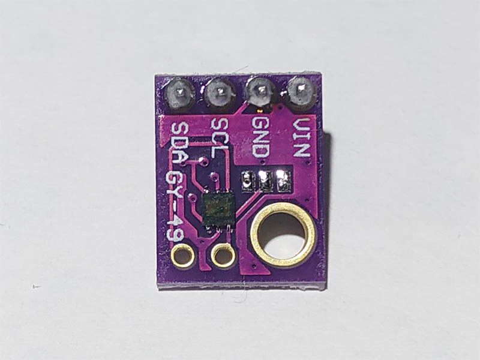
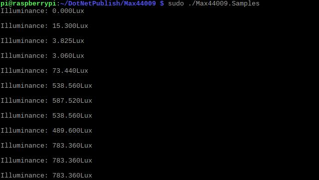

# MAX44009 - Ambient Light Sensor

The MAX44009 ambient light sensor features an I2C digital output that is ideal for a number of portable applications such as smartphones, notebooks, and industrial sensors. At less than 1µA operating current, it is the lowest power ambient light sensor in the industry and features an ultra-wide 22-bit dynamic range from 0.045 lux to 188,000 lux.



## Documentation

- You can find the datasheet [here](https://cdn.datasheetspdf.com/pdf-down/M/A/X/MAX44009_MaximIntegratedProducts.pdf)

## Usage

**Important**: make sure you properly setup the I2C pins especially for ESP32 before creating the `I2cDevice`, make sure you install the `nanoFramework.Hardware.ESP32 nuget`:

```csharp
//////////////////////////////////////////////////////////////////////
// when connecting to an ESP32 device, need to configure the I2C GPIOs
// used for the bus
Configuration.SetPinFunction(21, DeviceFunction.I2C1_DATA);
Configuration.SetPinFunction(22, DeviceFunction.I2C1_CLOCK);
```

For other devices like STM32, please make sure you're using the preset pins for the I2C bus you want to use.

### Hardware Required

- MAX44009
- Male/Female Jumper Wires

### Circuit


- SCL - SCL
- SDA - SDA
- VCC - 5V
- GND - GND

```csharp
I2cConnectionSettings settings = new I2cConnectionSettings(1, Max44009.DefaultI2cAddress);
I2cDevice device = I2cDevice.Create(settings);

// integration time is 100ms
using (Max44009 sensor = new Max44009(device, IntegrationTime.Time100))
{
    while (true)
    {
        // read illuminance
        Debug.WriteLine($"Illuminance: {sensor.Illuminance}Lux");
        Debug.WriteLine();

        Thread.Sleep(1000);
    }
}
```

### Result


