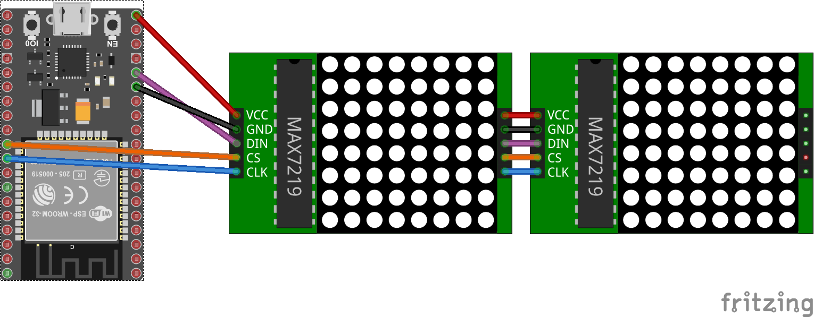

# Max7219 (LED Matrix driver)

 You can use [Max7219.cs](Max7219.cs) in your project to drive a Max7219 based Dot Matrix Module. Write to a 8x8 Dot Matrix Module demonstrates a concrete example using this class.

 The following fritzing diagram illustrates one way to wire up the Max7219, with a MCU like ESP32.



## Usage

**Important**: make sure you properly setup the SPI pins especially for ESP32 before creating the `SpiDevice`, make sure you install the `nanoFramework.Hardware.ESP32 nuget`:

```csharp
//////////////////////////////////////////////////////////////////////
// when connecting to an ESP32 device, need to configure the SPI GPIOs
// used for the bus
Configuration.SetPinFunction(21, DeviceFunction.SPI1_MOSI);
Configuration.SetPinFunction(22, DeviceFunction.SPI1_MISO);
Configuration.SetPinFunction(23, DeviceFunction.SPI1_CLOCK);
// Make sure as well you are using the right chip select
```

For other devices like STM32, please make sure you're using the preset pins for the SPI bus you want to use. The chip select can as well be pre setup.

You can use .NET Core to drive MAX7219 based Dot Matrix Modules.

These Modules can be cascaded to get a bigger matrix.

### Accessing the MAX7219 via SPI

The MCU has support for SPI. 

```csharp
// Note: the ChipSelect pin should be adjusted to your device, here 42
var connectionSettings = new SpiConnectionSettings(1, 42)
{
    ClockFrequency = 10_000_000,
    Mode = SpiMode.Mode0
};
var spi = SpiDevice.Create(connectionSettings);
var devices = new Max7219(spi, cascadedDevices: 4);
```

The following pin layout:

* MAX7219 VCC to MCU 5V
* MAX7219 GND to MCU GND
* MAX7219 DIN to MCU MOSI
* MAX7219 CS to MCU Chip Select
* MAX7219 CLK to MCU SPI Clock

### Writing to the Matrix

Write a smiley to devices buffer.

```csharp
var smiley = new byte[] { 
    0b00111100, 
    0b01000010, 
    0b10100101, 
    0b10000001, 
    0b10100101, 
    0b10011001, 
    0b01000010, 
    0b00111100 
    };
devices.Init();
devices.Rotation = RotationType.Half;
for (var i = 0; i < devices.CascadedDevices; i++)
{
    for (var digit = 0; digit < 8; digit++)
    {
        devices[new DeviceIdDigit( deviceId: i, digit: digit )] = smiley[digit];
    }

    devices.Flush();
}

```

Flush the smiley to the devices using a different rotation each iteration.

```csharp
foreach (RotationType rotation in Enum.GetValues(typeof(RotationType)))
{
    devices.Rotation = rotation;
    devices.Flush();
    Thread.Sleep(1000);
}
```

Write "Hello World from MAX7219!" to the Matrix using different fonts each iteration.

```csharp
devices.Init();
devices.Rotation = RotationType.Left;
var writer = new MatrixGraphics(devices, Fonts.CP437);
foreach (var font in new[]{Fonts.CP437, Fonts.LCD, Fonts.Sinclair, Fonts.Tiny, Fonts.CyrillicUkrainian}) {
    writer.Font = font;
    writer.ShowMessage("Hello World from MAX7219!", alwaysScroll: true);
}
```
