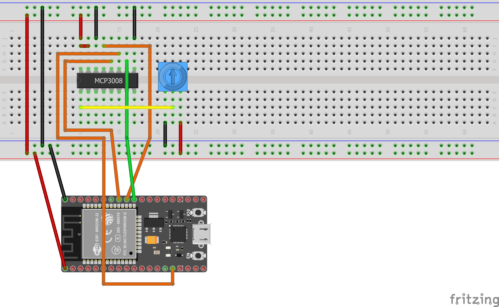
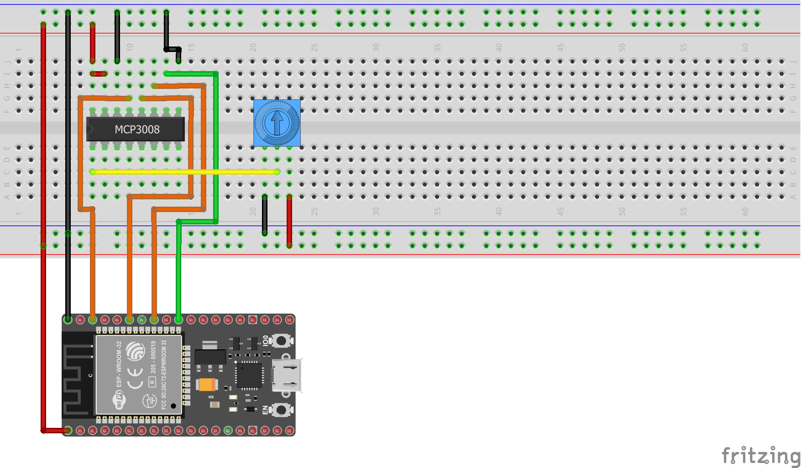

# MCP3001/MCP3002/MCP3004/MCP3008/MCP3201/MCP3202/MCP3204/MCP3208/MCP3301/MCP3302/MCP3304 family of Analog to Digital Converters

Some devices like the Raspberry Pi cannot read analog values directly so rely on  [analog to digital converters](https://en.wikipedia.org/wiki/Analog-to-digital_converter), like the ones available from Microchip in the Mcp3000, Mcp3200 and Mcp3300 ranges. These chips can be accessed as an [SPI device](https://en.wikipedia.org/wiki/Serial_Peripheral_Interface) or manually via raw GPIO pins. Normally all MCU has an analogic capability but the number of pins can be limited. This is typically useful when you want your MCU to have more than the number of ADC available. Another case is if you need a different resolution or voltage reference.

You can use these converters in your project to access analog devices.

The following fritzing diagram illustrates one way to wire up the Mcp3008, with an ESP32 and a potentiometer.



## Documentation

The sample is based on following resources:

- [Analog Inputs for Raspberry Pi Using the MCP3008](https://learn.adafruit.com/reading-a-analog-in-and-controlling-audio-volume-with-the-raspberry-pi)
- [Raspberry Pi Analog to Digital Converters](https://learn.adafruit.com/raspberry-pi-analog-to-digital-converters).
- [Raspbery Pi Analog Input with MCP3008](https://gist.github.com/ladyada/3151375)
- [MCP3008.py](https://github.com/adafruit/Adafruit_Python_MCP3008/blob/master/Adafruit_MCP3008/MCP3008.py)

Major thanks to [Adafruit](https://adafruit.com) for providing python implementations, which were ported to C# for this sample.

## Usage

**Important**: make sure you properly setup the SPI pins especially for ESP32 before creating the `SpiDevice`, make sure you install the `nanoFramework.Hardware.ESP32 nuget`:

```csharp
//////////////////////////////////////////////////////////////////////
// when connecting to an ESP32 device, need to configure the SPI GPIOs
// used for the bus
Configuration.SetPinFunction(21, DeviceFunction.SPI1_MOSI);
Configuration.SetPinFunction(22, DeviceFunction.SPI1_MISO);
Configuration.SetPinFunction(23, DeviceFunction.SPI1_CLOCK);
// Make sure as well you are using the right chip select
```

For other devices like STM32, please make sure you're using the preset pins for the SPI bus you want to use. The chip select can as well be pre setup.

### Hardware elements

The following elements are used in this sample:

- [Potentiometer](https://www.adafruit.com/product/356)
- [MCP3008](https://www.adafruit.com/product/856)

### Accessing the MCP3008 via SPI

The MCU has support for SPI. 

You can use the following code to [access the MCP3008 via hardware SPI](./samples/Program.cs):

```csharp
var hardwareSpiSettings = new SpiConnectionSettings(1, 42)
{
    ClockFrequency = 1000000
};

using (SpiDevice spi = SpiDevice.Create(hardwareSpiSettings))
using (Mcp3008 mcp = new Mcp3008(spi))
{
    while (true)
    {
        double value = mcp.Read(0);
        value = value / 10.24;
        value = Math.Round(value);
        Debug.WriteLine($"{value}%");
        Thread.Sleep(500);
    }
}
```

The following pin layout can be used:

- MCP3008 VDD to MCU 3.3V
- MCP3008 VREF to MCU 3.3V
- MCP3008 AGND to MCU GND
- MCP3008 DGND to MCU GND
- MCP3008 CLK to MCU SCLK
- MCP3008 DOUT to MCU MISO
- MCP3008 DIN to MCU MOSI
- MCP3008 CS/SHDN to MCU CE0


### Accessing the MCP3008 via GPIO

You can also access the MCP3008 via GPIO pins, implementing SPI manually. This method is referred to as [bit-banging](https://en.wikipedia.org/wiki/Serial_Peripheral_Interface#Example_of_bit-banging_the_master_protocol).

You can use the following code to [access the MCP3008 via GPIO](./samples/Program.cs):

```csharp
using (SpiDevice spi = new SoftwareSpi(clk: 18, miso: 23, mosi: 24, cs: 25))
using (Mcp3008 mcp = new Mcp3008(spi))
{
    while (true)
    {
        double value = mcp.Read(0);
        value = value / 10.24;
        value = Math.Round(value);
        Debug.WriteLine($"{value}%");
        Thread.Sleep(500);
    }
}
```

The following pin layout can be used:

- MCP3008 VDD to MCU 3.3V
- MCP3008 VREF to MCU 3.3V
- MCP3008 AGND to MCU GND
- MCP3008 DGND to MCU GND
- MCP3008 CLK to any valid GPIO on the MCU
- MCP3008 DOUT to any valid GPIO on the MCU
- MCP3008 DIN to any valid GPIO on the MCU
- MCP3008 CS/SHDN to any valid GPIO on the MCU



### Processing the data

Independent of the way in which you access the MCP3008 chip, the code to process its results is the same, which follows.

```csharp
while (true)
{
    double value = mcp.Read(0);
    value = value / 10.24;
    value = Math.Round(value);
    Debug.WriteLine(value);
    Thread.Sleep(500);
}
```

The chip is 10-bit, which means that it will generate values from 0-1023 (recall that 2^10 is 1024). We can transform the value to a more familiar 0-100 scale by dividing the 10-bit value by 10.24.

## Remarks

These bindings support the following ADC's

- [Mcp3001](http://ww1.microchip.com/downloads/en/DeviceDoc/21293C.pdf) 10 bit resolution with a single pseudo-differential input.
- [Mcp3002](http://ww1.microchip.com/downloads/en/DeviceDoc/21294E.pdf) 10 bit resolution with two single ended inputs or a single pseudo-differential input.
- [Mcp3004](http://ww1.microchip.com/downloads/en/devicedoc/21295c.pdf) 10 bit resolution with four single ended inputs or two single pseudo-differential inputs.
- [Mcp3008](http://ww1.microchip.com/downloads/en/devicedoc/21295c.pdf) 10 bit resolution with eight single ended inputs or four single pseudo-differential inputs.

- [Mcp3201](http://ww1.microchip.com/downloads/en/devicedoc/21290d.pdf) 12 bit resolution with a single pseudo-differential input.
- [Mcp3202](http://ww1.microchip.com/downloads/en/devicedoc/21034d.pdf) 12 bit resolution with two single ended inputs or a single pseudo-differential input.
- [Mcp3204](http://ww1.microchip.com/downloads/en/DeviceDoc/21298c.pdf) 12 bit resolution with four single ended inputs or two single pseudo-differential inputs.
- [Mcp3208](http://ww1.microchip.com/downloads/en/DeviceDoc/21298c.pdf) 12 bit resolution with eight single ended inputs or four single pseudo-differential inputs.

- [Mcp3301](http://ww1.microchip.com/downloads/en/devicedoc/21700d.pdf) 13 bit signed resolution with a single true differential input.
- [Mcp3202](http://ww1.microchip.com/downloads/en/DeviceDoc/21697F.pdf) 12 bit resolution with four single ended inputs or 13 bit signed resolution with two true differential inputs.
- [Mcp3304](http://ww1.microchip.com/downloads/en/DeviceDoc/21697F.pdf) 12 bit resolution with eight single ended inputs or 13 bit signed resolution with four true differential inputs.

Note: Currently untested on the Mcp33xx family.
