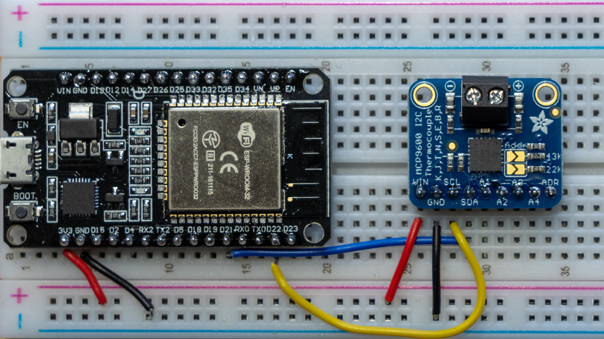

# MCP960X - device family of cold-junction compensated thermocouple to digital converter

The MCP960X device family is an I2C interface cold-junction compensated thermocouple to digital converter.
Supported thermocouple types (designated by NIST ITS-90) are: K, J, T, N, S, E, B and R.
The MCP9600/01 converts the thermocouple EMF to degree Celsius with integrated cold-junction compensation.

**Note:** _Default thermocouple type is K_

## Sensor Image



## Documentation

**MCP960X** [datasheet](https://www.microchip.com/en-us/product/MCP9600)

## Usage

**Important**: make sure you properly setup the I2C pins especially for ESP32 before creating the `I2cDevice`, make sure you install the `nanoFramework.Hardware.ESP32 nuget`:

```csharp
//////////////////////////////////////////////////////////////////////
// when connecting to an ESP32 device, need to configure the I2C GPIOs
// used for the bus
Configuration.SetPinFunction(21, DeviceFunction.I2C1_DATA);
Configuration.SetPinFunction(22, DeviceFunction.I2C1_CLOCK);
```

For other devices like STM32, please make sure you're using the preset pins for the I2C bus you want to use.
The sample reads two temperatures. One is a connected thermocouple reading which can be read using the  ```GetTemperature``` command and the other is the temperature of the device itself which can be read using the ```GetColdJunctionTemperature``` command. The Cold Junction Temperature is used internally to increase the accuracy of the thermocouple.

```csharp
using Iot.Device.Mcp960x;
using nanoFramework.Hardware.Esp32;
using System.Device.I2c;
using System.Diagnostics;
using System.Threading;

Debug.WriteLine("Write I2C MCP960X - ADR 0x67 - Read ambient and hot junction temperature every 1 sec");

// redefine I2C pins to match your ESP32 DevKit
// Configuration.SetPinFunction(21, DeviceFunction.I2C1_DATA);
// Configuration.SetPinFunction(22, DeviceFunction.I2C1_CLOCK);

// set I2C bus ID: 1
// 0x67 is the device address
I2cConnectionSettings settings = new I2cConnectionSettings(1, 0x67);
I2cDevice i2cDevice = I2cDevice.Create(settings);
Mcp960x mcp960x = new Mcp960x(i2cDevice, coldJunctionResolutionType: ColdJunctionResolutionType.N_0_25);

DeviceIDType deviceIDType;
byte major;
byte minor;
mcp960x.ReadDeviceID(out deviceIDType, out major, out minor);
Debug.WriteLine($"device id: {(byte)deviceIDType} - major: {major} - minor: {minor}");

while (true)
{
    Debug.WriteLine($"ambient temperture: {mcp960x.GetColdJunctionTemperature()}");
    Debug.WriteLine($"hot junction temperture: {mcp960x.GetTemperature()}");

    Thread.Sleep(1000);
}
```
