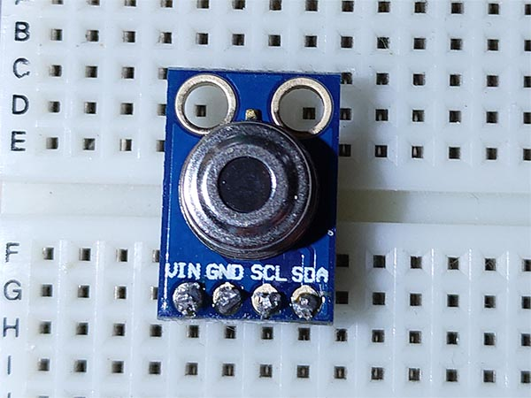
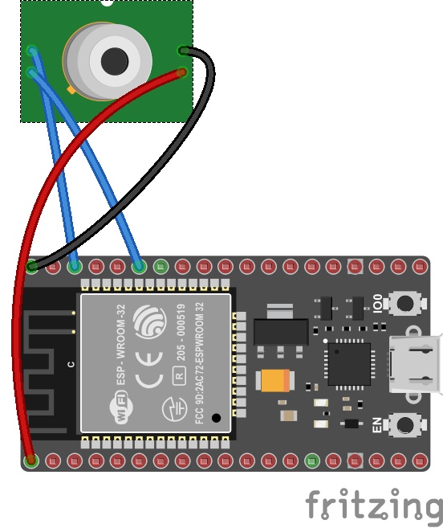
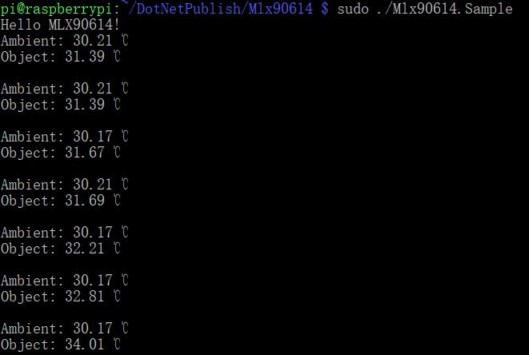

# MLX90614 - Infra Red Thermometer

The MLX90614 is an Infra Red thermometer for noncontact temperature measurements. Both the IR sensitive thermopile detector chip and the signal conditioning ASSP are integrated in the same TO-39 can. Thanks to its low noise amplifier, 17-bit ADC and powerful DSP unit, a high accuracy and resolution of the thermometer is achieved.

## Documentation

- You can find the datasheet [here](https://cdn.datasheetspdf.com/pdf-down/M/L/X/MLX90614-Melexis.pdf)

## Board



## Usage

**Important**: make sure you properly setup the I2C pins especially for ESP32 before creating the `I2cDevice`, make sure you install the `nanoFramework.Hardware.ESP32 nuget`:

```csharp
//////////////////////////////////////////////////////////////////////
// when connecting to an ESP32 device, need to configure the I2C GPIOs
// used for the bus
Configuration.SetPinFunction(21, DeviceFunction.I2C1_DATA);
Configuration.SetPinFunction(22, DeviceFunction.I2C1_CLOCK);
```

For other devices like STM32, please make sure you're using the preset pins for the I2C bus you want to use.

### Hardware Required

- MLX90614
- Male/Female Jumper Wires

### Circuit



- SCL - SCL
- SDA - SDA
- VCC - 5V/3V
- GND - GND

**Warning: MLX90614 includes 5V and 3V versions!**

### Code

```csharp
I2cConnectionSettings settings = new I2cConnectionSettings(1, Mlx90614.DefaultI2cAddress);
I2cDevice i2cDevice = I2cDevice.Create(settings);

using (Mlx90614 sensor = new Mlx90614(i2cDevice))
{
    while (true)
    {
        Debug.WriteLine($"Ambient: {sensor.ReadAmbientTemperature().Celsius} ℃");
        Debug.WriteLine($"Object: {sensor.ReadObjectTemperature().Celsius} ℃");
        Debug.WriteLine();

        Thread.Sleep(1000);
    }
}
```

### Result


