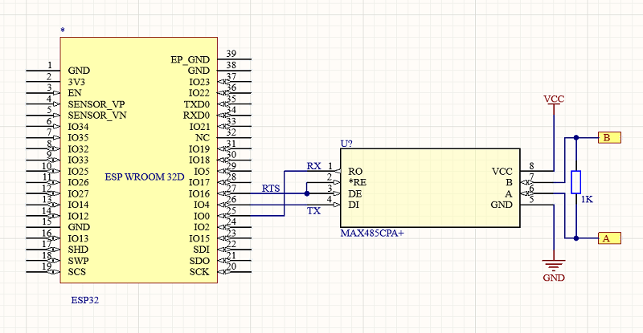

# Modbus - Machine to machine communication protocol

Modbus communication protocol addresses architectures for distributed automation systems across multiple market segments. It can be serial port based or network based. This implementation is serial port based but can be adjusted to support networking easily.

## Documentation

Modbus specifications can be found on the [Modbus organization website](https://www.modbus.org/specs.php).

## Usage

If you are using an ESP32, you must initialize the pins to use serial port like this:

```csharp
// SerialPort COM2
Configuration.SetPinFunction(16, DeviceFunction.COM2_RX);
Configuration.SetPinFunction(17, DeviceFunction.COM2_TX);
Configuration.SetPinFunction(18, DeviceFunction.COM2_RTS);
```

With an ESP32, you can almost use any pin for any function. When using an STM32 or other MCU, the pins are usually fixed. Refer to the documentation of your MCU to understand which pin to use.

### Modbus client

To initialize and use a Modbus client, you can do the following:

```csharp
// Modbus Client
var client = new ModbusClient("COM3");
client.ReadTimeout = client.WriteTimeout =2000;

client.WriteMultipleRegisters(2,0x5, new ushort[] {3,5,2,3 });
client.Raw(2, FunctionCode.Diagnostics, new byte[] {0x01,0x01,0x01,0x01 });

var data1 = client.ReadHoldingRegisters(2,0x7,4);
var data2 = client.ReadCoils(2,0x23,2);
```

As shown in the sample, you have the possibility to write multiple registers, use raw function and also ready multiple registers.

### Support for logging

This library uses `Microsoft.Extensions.Logging`. The `ModbusClient` exposes a `Logger` property you can assign with any `ILogger` implementation. When set, TX/RX frames and errors are logged. Function codes are rendered with readable names. Server-side logging is not implemented yet.

Minimal example:

```csharp
using Iot.Device.Modbus.Client;
using nanoFramework.Logging.Debug; // DebugLogger
using Microsoft.Extensions.Logging;

// Create client and attach a logger (use any ILogger implementation)
var client = new ModbusClient("COM3");
var logger = new DebugLogger("ModbusClient") { MinLogLevel = LogLevel.Debug };
client.Logger = logger;

// Operations now emit logs like:
// Reading ReadHoldingRegisters from Device ID2, Start Address7, Count4
// COM3 TX (1):02
// COM3 TX (8):020300070004 C5 F9
// COM3 RX (13):02030800000000000000003A C4
// Errors (if any) look like:
// COM3 RX (E): Modbus ErrorCode IllegalDataAddress
client.ReadHoldingRegisters(2,0x7,4);
```

You can plug any logging provider compatible with `Microsoft.Extensions.Logging` (for example, [nanoFramework.Logging](https://www.nuget.org/packages/nanoFramework.Logging/)).

### Modbus server

A server implementation is also available:

```csharp
// Modbus Server
var server = new ModbusServer(new Device(1), "COM2");
server.ReadTimeout = server.WriteTimeout =2000;
server.StartListening();
```

This server implementation will allow you to act as a server. It can be extended.

## Hardware implementation

When using Modbus with an RS485, you can for example use a MAX485 to make the interface between the traditional serial port and RS485:



## RS232 support

You can change the ```mode``` parameter in constructor to0 (SerialMode.Normal) if you're using Modbus over RS232
```csharp
// Modbus Client
var client = new ModbusClient("COM3",SerialMode.Normal); 
// Modbus Server
var server = new ModbusServer(new Device(1), "COM2",mode:SerialMode.Normal);
```

## Limitations

**NOTE:** nanoFramework only (currently) supports the "Modbus-RTU" protocol.
