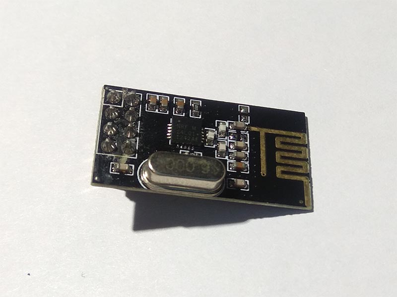
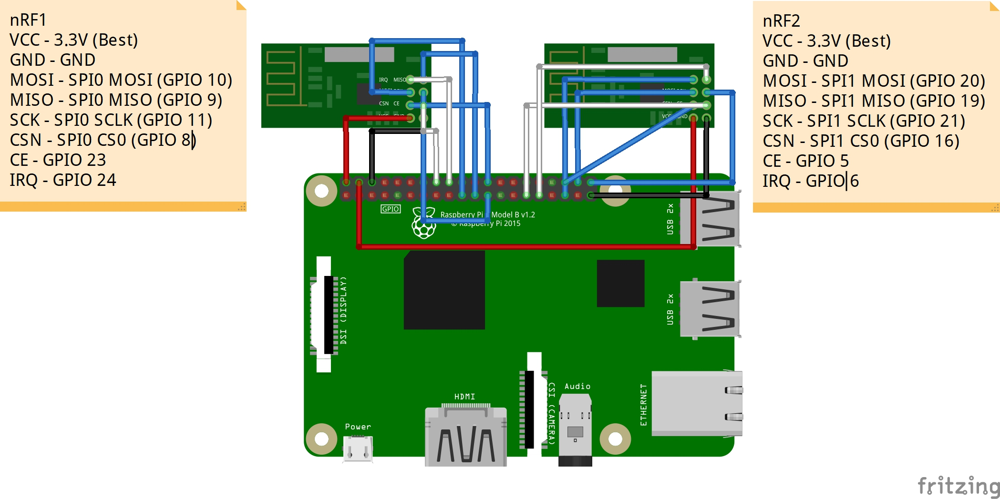
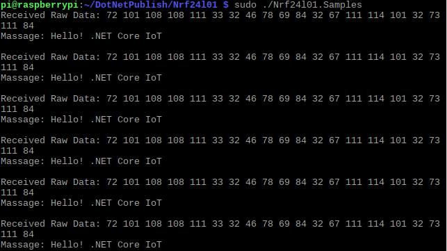

# nRF24L01 - Single Chip 2.4 GHz Transceiver

The nRF24L01 is a single chip radio transceiver for the world wide 2.4 - 2.5 GHz ISM band.

## Documentation

- The bindging datasheet can be found [here](https://cdn.datasheetspdf.com/pdf-down/N/R/F/NRF24L01-Nordic.pdf)

## Board



Note: the following diagram uses a Raspberry Pi. This can be achieved with any MCU having 2 available SPI.



## Usage

### Hardware Required

- nRF24L01 × 2
- Male/Female Jumper Wires

### Connection for nRF1

- VCC - 3.3V (Best)
- GND - GND
- MOSI - SPI0 MOSI (GPIO 10)
- MISO - SPI0 MISO (GPIO 9)
- SCK - SPI0 SCLK (GPIO 11)
- CSN - SPI0 CS0 (GPIO 8)
- CE - GPIO 23
- IRQ - GPIO 24

### Connection for nRF2

- VCC - 3.3V (Best)
- GND - GND
- MOSI - SPI1 MOSI (GPIO 20)
- MISO - SPI1 MISO (GPIO 19)
- SCK - SPI1 SCLK (GPIO 21)
- CSN - SPI1 CS0 (GPIO 16)
- CE - GPIO 5
- IRQ - GPIO 6

### Code

**Important**: make sure you properly setup the SPI pins especially for ESP32 before creating the `SpiDevice`, make sure you install the `nanoFramework.Hardware.ESP32 nuget`:

```csharp
//////////////////////////////////////////////////////////////////////
// when connecting to an ESP32 device, need to configure the SPI GPIOs
// used for the bus
Configuration.SetPinFunction(21, DeviceFunction.SPI1_MOSI);
Configuration.SetPinFunction(22, DeviceFunction.SPI1_MISO);
Configuration.SetPinFunction(23, DeviceFunction.SPI1_CLOCK);
// Make sure as well you are using the right chip select
```

For other devices like STM32, please make sure you're using the preset pins for the SPI bus you want to use. The chip select can as well be pre setup.

```csharp

SpiConnectionSettings senderSettings = new SpiConnectionSettings(1, 42)
{
    ClockFrequency = Nrf24l01.SpiClockFrequency,
    Mode = Nrf24l01.SpiMode
};

SpiConnectionSettings receiverSettings = new SpiConnectionSettings(2, 44)
{
    ClockFrequency = Nrf24l01.SpiClockFrequency,
    Mode = Nrf24l01.SpiMode
};
var senderDevice = SpiDevice.Create(senderSettings);
var receiverDevice = SpiDevice.Create(receiverSettings);

// SPI Device, CE Pin, IRQ Pin, Receive Packet Size
using (Nrf24l01 sender = new Nrf24l01(senderDevice, 23, 24, 20))
{
    using (Nrf24l01 receiver = new Nrf24l01(receiverDevice, 5, 6, 20))
    {
        // Set sender send address, receiver pipe0 address (Optional)
        byte[] receiverAddress = Encoding.UTF8.GetBytes("NRF24");
        sender.Address = receiverAddress;
        receiver.Pipe0.Address = receiverAddress;

        // Binding DataReceived event
        receiver.DataReceived += Receiver_ReceivedData;

        // Loop
        while (true)
        {
            sender.Send(Encoding.UTF8.GetBytes("Hello! .NET Core IoT"));

            Thread.Sleep(2000);
        }
    }
}

private static void Receiver_ReceivedData(object sender, DataReceivedEventArgs e)
{
    var raw = e.Data;
    var msg = Encoding.UTF8.GetString(raw);

    Debug.Write("Received Raw Data: ");
    foreach (var item in raw)
    {
        Debug.Write($"{item} ");
    }
    Debug.WriteLine();

    Debug.WriteLine($"Message: {msg}");
    Debug.WriteLine();
}
```

### Result


