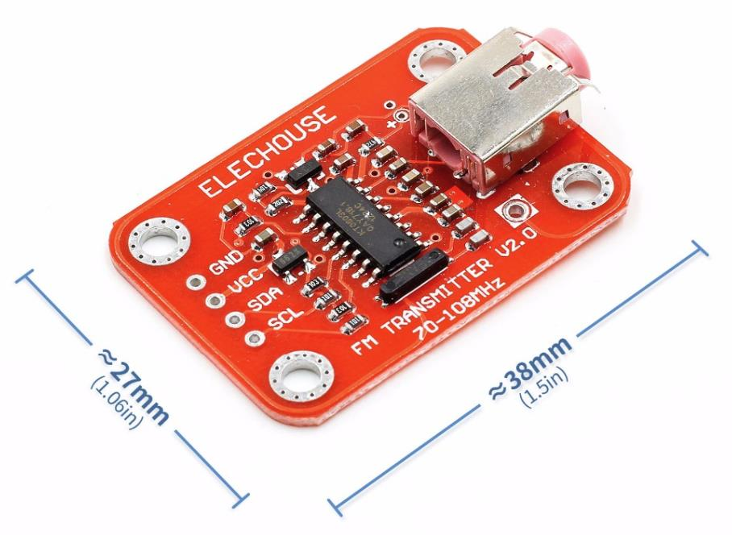

# KT0803 - Radio Transmitter
KT0803, a new generation of low cost Monolithic Digital FM Transmitter, is designed to process high-fidelity stereo audio signal and transmit modulated FM signal over a short range. 

## Sensor Image



## Usage

**Important**: make sure you properly setup the I2C pins especially for ESP32 before creating the `I2cDevice`, make sure you install the `nanoFramework.Hardware.ESP32 nuget`:

```csharp
//////////////////////////////////////////////////////////////////////
// when connecting to an ESP32 device, need to configure the I2C GPIOs
// used for the bus
Configuration.SetPinFunction(21, DeviceFunction.I2C1_DATA);
Configuration.SetPinFunction(22, DeviceFunction.I2C1_CLOCK);
```

For other devices like STM32, please make sure you're using the preset pins for the I2C bus you want to use.

```csharp
I2cConnectionSettings settings = new I2cConnectionSettings(1, Kt0803.DefaultI2cAddress);
I2cDevice device = I2cDevice.Create(settings);

// The radio is running on FM 106.6MHz
using (Kt0803 radio = new Kt0803(device, 106.6, Region.China))
{
    // Connect a sound sources to the 3.5mm earphone jack of the module
}
```