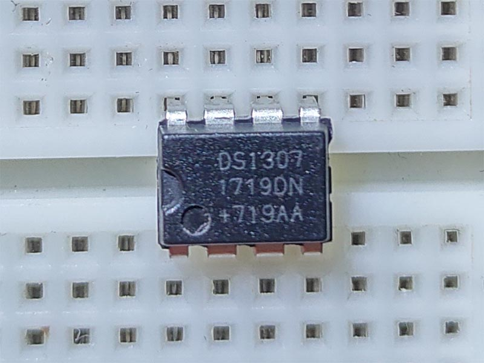

# DS1307 - Realtime Clock
The DS1307 serial real-time clock (RTC) is a lowpower, full binary-coded decimal (BCD) clock/calendar plus 56 bytes of NV SRAM. Address and data are transferred serially through an I2C, bidirectional bus.

## Sensor Image



## Usage

**Important**: make sure you properly setup the I2C pins especially for ESP32 before creating the `I2cDevice`, make sure you install the `nanoFramework.Hardware.ESP32 nuget`:

```csharp
//////////////////////////////////////////////////////////////////////
// when connecting to an ESP32 device, need to configure the I2C GPIOs
// used for the bus
Configuration.SetPinFunction(21, DeviceFunction.I2C1_DATA);
Configuration.SetPinFunction(22, DeviceFunction.I2C1_CLOCK);
```

For other devices like STM32, please make sure you're using the preset pins for the I2C bus you want to use.

```csharp
I2cConnectionSettings settings = new I2cConnectionSettings(1, Ds1307.DefaultI2cAddress);
I2cDevice device = I2cDevice.Create(settings);

using (Ds1307 rtc = new Ds1307(device))
{
    // set Ds1307 time
    rtc.DateTime = DateTime.Now;
    // read time
    DateTime dt = rtc.DateTime;
}
```
