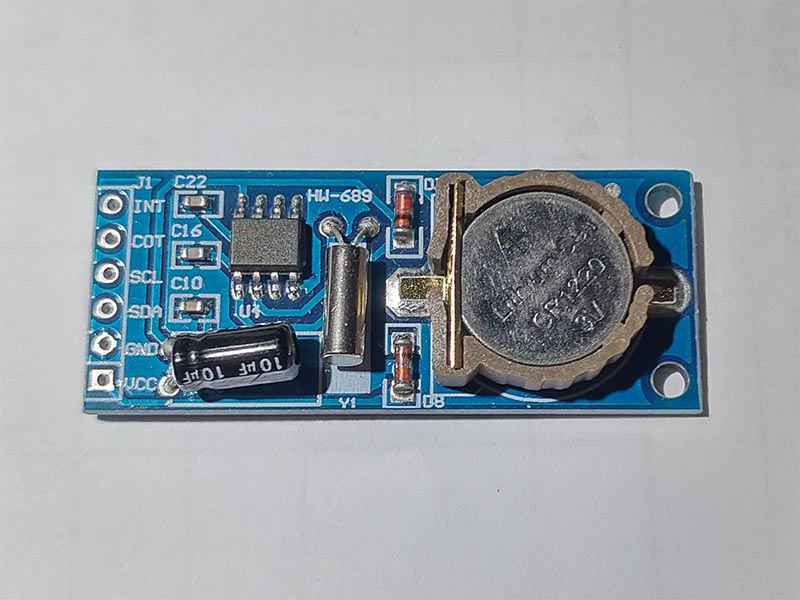

# PCF8563 - Realtime Clock
The PCF8563 is a CMOS1 Real-Time Clock (RTC) and calendar optimized for low power consumption. A  programmable clock output, interrupt output, and voltage-low detector are also provided. All addresses and data are transferred serially via a two-line bidirectional I2C-bus.

## Sensor Image



## Usage

**Important**: make sure you properly setup the I2C pins especially for ESP32 before creating the `I2cDevice`, make sure you install the `nanoFramework.Hardware.ESP32 nuget`:

```csharp
//////////////////////////////////////////////////////////////////////
// when connecting to an ESP32 device, need to configure the I2C GPIOs
// used for the bus
Configuration.SetPinFunction(21, DeviceFunction.I2C1_DATA);
Configuration.SetPinFunction(22, DeviceFunction.I2C1_CLOCK);
```

For other devices like STM32, please make sure you're using the preset pins for the I2C bus you want to use.

```csharp
I2cConnectionSettings settings = new I2cConnectionSettings(1, Pcf8563.DefaultI2cAddress);
I2cDevice device = I2cDevice.Create(settings);

using (Pcf8563 rtc = new Pcf8563(device))
{
    // set Pcf8563 time
    rtc.DateTime = DateTime.Now;
    // read time
    DateTime dt = rtc.DateTime;
}
```
