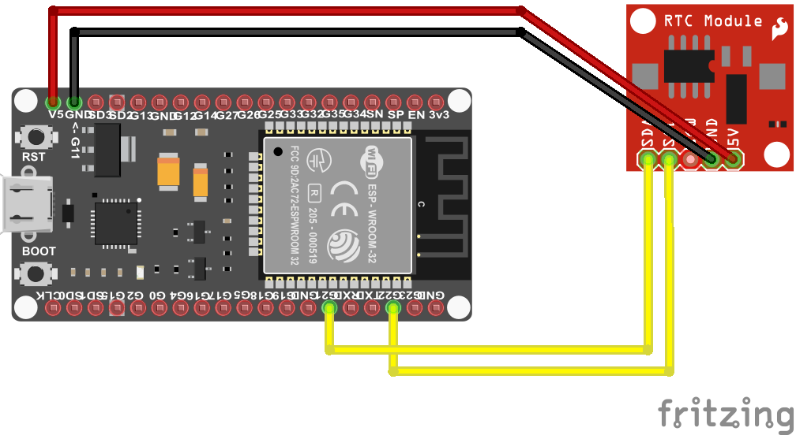

# Realtime Clock
The RTC devices supported by the project include DS1307, DS3231, PCF8563 (or compatible BM8563).

## Documentation
- DS1307 [datasheet](https://cdn.datasheetspdf.com/pdf-down/D/S/1/DS1307-Maxim.pdf)
- DS3231 [datasheet](https://datasheets.maximintegrated.com/en/ds/DS3231.pdf)
- PCF8563 / BM8563 [datasheet](https://cdn.datasheetspdf.com/pdf-down/P/C/F/PCF-856.pdf)

## Board



## Usage

**Important**: make sure you properly setup the I2C pins especially for ESP32 before creating the `I2cDevice`, make sure you install the `nanoFramework.Hardware.ESP32 nuget`:

```csharp
//////////////////////////////////////////////////////////////////////
// when connecting to an ESP32 device, need to configure the I2C GPIOs
// used for the bus
Configuration.SetPinFunction(21, DeviceFunction.I2C1_DATA);
Configuration.SetPinFunction(22, DeviceFunction.I2C1_CLOCK);
```

For other devices like STM32, please make sure you're using the preset pins for the I2C bus you want to use.

### Hardware Required

- DS1307/DS3231/PCF8563/BM8563
- Male/Female Jumper Wires
 
```csharp
using System.Device.I2c;
using Iot.Device.Rtc;
using nanoFramework.Hardware.Esp32;

// The I2C pins 21 and 22 in the sample below are ESP32 specific and may differ from other platforms.
// Please double check your device datasheet.
Configuration.SetPinFunction(22, DeviceFunction.I2C1_CLOCK);
Configuration.SetPinFunction(21, DeviceFunction.I2C1_DATA);

I2cConnectionSettings settings = new I2cConnectionSettings(1, Pcf8563.DefaultI2cAddress);
I2cDevice device = I2cDevice.Create(settings);

using (Pcf8563 rtc = new Pcf8563(device))
{
    // set Pcf8563 dateTime
    // rtc.DateTime = GetDateTimeFromInternet();
    rtc.DateTime = new DateTime(2021, 9, 8, 10, 11, 12);
    
    while (true)
    {
        // read time
        DateTime dt = rtc.DateTime;
        
        // output the current time
        Debug.WriteLine($"Time: {dt.ToString("yyyy/MM/dd HH:mm:ss")}");
        
        // wait for a second
        Thread.Sleep(1000);
    }
}
```
### Result


