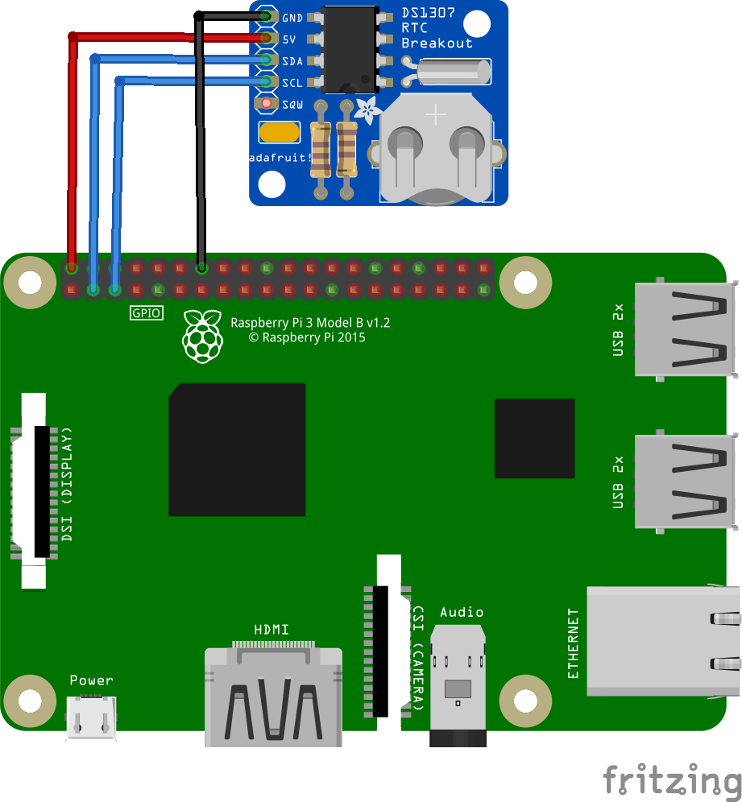
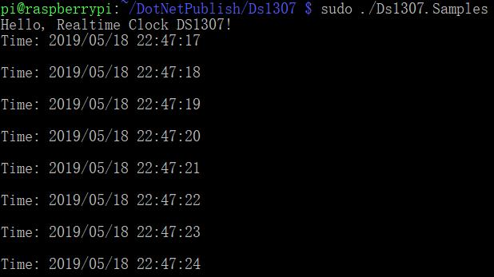

# RealtimeClock - Samples

## Hardware Required
* DS1307/DS3231/PCF8563
* Male/Female Jumper Wires

## Circuit

### I2C Devices



* SCL - SCL
* SDA - SDA
* VCC - 5V
* GND - GND

## Code

**Important**: make sure you properly setup the I2C pins especially for ESP32 before creating the `I2cDevice`, make sure you install the `nanoFramework.Hardware.ESP32 nuget`:

```csharp
//////////////////////////////////////////////////////////////////////
// when connecting to an ESP32 device, need to configure the I2C GPIOs
// used for the bus
Configuration.SetPinFunction(21, DeviceFunction.I2C1_DATA);
Configuration.SetPinFunction(22, DeviceFunction.I2C1_CLOCK);
```

For other devices like STM32, please make sure you're using the preset pins for the I2C bus you want to use.

```csharp
Debug.WriteLine("Hello, Realtime Clock DS1307!");

I2cConnectionSettings settings = new I2cConnectionSettings(1, Ds1307.DefaultI2cAddress);
I2cDevice device = I2cDevice.Create(settings);

using (Ds1307 rtc = new Ds1307(device))
{
    // set DS1307 time
    rtc.DateTime = DateTime.Now;

    // loop
    while (true)
    {
        // read time
        DateTime dt = rtc.DateTime;

        Debug.WriteLine($"Time: {dt.ToString("yyyy/MM/dd HH:mm:ss")}");
        Debug.WriteLine();

        // wait for a second
        Thread.Sleep(1000);
    }
}
```

## Result

