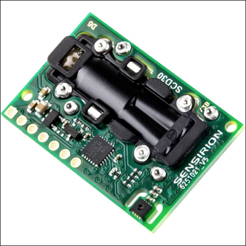

# Sensirion SCD30 Particulate Matter Sensor

This is a library to interact with the Sensirion SCD30 Sensor Module for CO2, humidity and temperature. Currently, only the Modbus interface is implemented. The SCD30 also supports I2C, but requires clock stretching, which is currently not supported in the .NET Nanoframework ESP32 implementation.



## Documentation

* For this implementation the official [datasheet](https://sensirion.com/media/documents/4EAF6AF8/61652C3C/Sensirion_CO2_Sensors_SCD30_Datasheet.pdf) and [interface description](https://sensirion.com/media/documents/D7CEEF4A/6165372F/Sensirion_CO2_Sensors_SCD30_Interface_Description.pdf) have been used.

## Usage for the Modbus interface

**Important**: make sure you properly setup the UART pins for ESP32 before creating the `SerialPort`. For this, make sure you install the `nanoFramework.Hardware.Esp32` NuGet and use the `Configuration` class to configure the pins:

```csharp
Configuration.SetPinFunction(5, DeviceFunction.COM3_TX);
Configuration.SetPinFunction(27, DeviceFunction.COM3_RX);
```

Initialize the `SerialPort` and pass it to the `Scd30Sensor`. You'll stay in control of the `SerialPort` for any exotic situations (i.e. `InvertSignalLevels` or multiplexing scenarios). The constructor of the `Scd30Sensor` will configure the `SerialPort` to the expected `BaudRate` and other settings:

```csharp
var scd30 = new Scd30Sensor(new SerialPort("COM3"));
```

Use the `scd30` to interact with the sensor, e.g.:

```csharp
var firmware = scd30.ReadFirmwareVersion();
Debug.WriteLine($"SCD30 detected: Firmware version={firmware}");
```

Collect a measurement reliably:

```csharp
scd30.SetMeasurementInterval(TimeSpan.FromSeconds(2));
scd30.StartContinuousMeasurement();
Thread.Sleep(5000);
if (scd30.GetDataReadyStatus())
{
    var measurement = scd30.ReadMeasurement();
    Debug.WriteLine($"Measurement: {measurement}");
}
```

The above would output the following:

```text
SCD30 detected: Firmware version=3.66
Measurement: Co2Concentration=400.8741 ppm, Temperature=27.10421752 °C, RelativeHumidity=32.75756835 %RH
```

Check out the sample for more information.

## I don't get any measurements and `GetDataReadyStatus` never returns true!

When this happens, make sure you provide enough current/voltage to your sensor. In my particular case I was providing power from the 3v3 of my Pycom WiPy to both the `vin` and `sel` pins
on the SCD30. However, the measurements never worked.

Instead, connecting the 5v to the `vin` and the 3v3 to `sel` made the SCD30 work as expected. The `sel` must be pulled high to enable the Modbus interface.

**DO NOT CONNECT 5V TO `sel`, it is only tolerant up to 4v so you must use a voltage divider if you do not have 3v3 available**