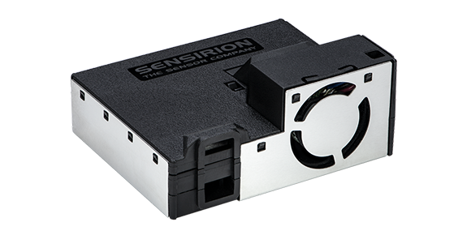

# Sensirion SEN5x series module

This is a library to interact with the Sensirion SEN5x Environmental Node.

Description from its [product page](https://developer.sensirion.com/sensirion-products/sen5x-environmental-sensor-node/):

> The SEN5x environmental node is a straightforward, all-in-one sensor solution platform for the accurate measurement of various environmental parameters, such as particulate matter, volatile organic compounds (VOCs), oxidizing gases, such as nitrogen oxide compounds (NOx), as well as humidity & temperature. Thanks to proprietary algorithms, the module enables straightforward integration into various applications. This allows device manufacturers to save valuable project time and personnel resources and focus on their core competencies. End customers receive reliable air quality measurement data based on the SEN5x and benefit from improved air quality to increase health and comfort.



## Documentation

For the implementation of this library the official [datasheet](https://developer.sensirion.com/fileadmin/user_upload/customers/sensirion/Dokumente/15_Environmental_Sensor_Node/Datasheets/Sensirion_Environmental_Sensor_Node_SEN5x_Datasheet.pdf). Any other documentation can be found on its [product page](https://developer.sensirion.com/sensirion-products/sen5x-environmental-sensor-node/).

There are three variants at the time of this writing:
* `SEN50-SDN-T`, which outputs: Particulate Matter
* `SEN54-SDN-T`, which outputs: Particulate Matter, Relative Humidity, Temperature, VOC Index
* `SEN55-SDN-T`, which outputs: Particulate Matter, Relative Humidity, Temperature, VOC Index, NOx Index

**Note that only the `SEN54-SDN-T` variant has been tested at this time.** Even though the NOx-specific methods have been made available, they have not been tested.

## Usage

The example project is built for ESP32 and therefor it uses the `nanoFramework.Hardware.Esp32` package to configure the correct pins for the I2C interface:

```csharp
Configuration.SetPinFunction(21, DeviceFunction.I2C1_DATA);
Configuration.SetPinFunction(22, DeviceFunction.I2C1_CLOCK);
```

Create the `I2cConnectionSettings` using correct I2C bus, address and speed. You can use the constants on the `Sen5xSensor` class for the defaults. Create the `I2cDevice` and pass that to the `Sen5xSensor` to create the instance to work with:

```csharp
var settings = new I2cConnectionSettings(1, Sen5xSensor.DefaultI2cAddress, Sen5xSensor.DefaultI2cBusSpeed);
var i2c = new I2cDevice(settings);
var sensor = new Sen5xSensor(i2c);
```

Use `sensor` for all interactions with the SEN5x sensor. The following starts the measurements, reads and prints measurements as they become ready:

```csharp
sensor.StartMeasurement();
while (true)
{
    if (sensor.ReadDataReadyFlag())
    {
        var measurement = sensor.ReadMeasurement();
        Debug.WriteLine(measurement.ToString());
    }
    Thread.Sleep(1000);
}
```

Make sure to refer to the datasheet when using the more advanced features.