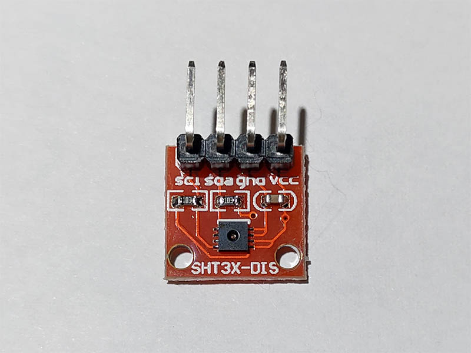
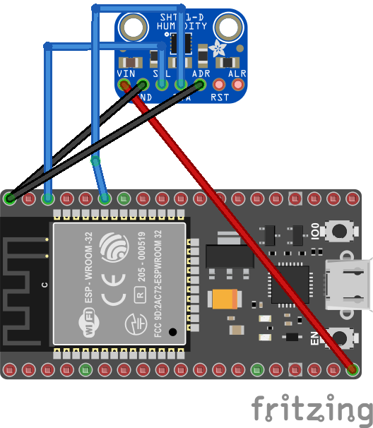
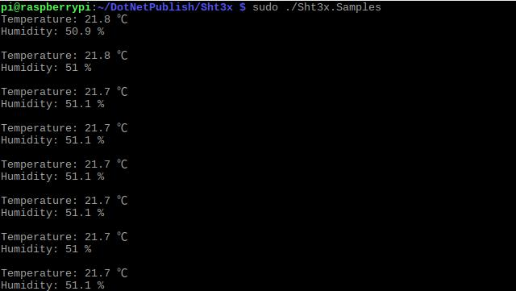

# SHT3x - Temperature & Humidity Sensor

SHT3x is the next generation of Sensirion’s temperature and humidity sensors. This project supports SHT30, SHT31 and SHT35.

## Documentation

- SHT30 [datasheet](https://cdn.datasheetspdf.com/pdf-down/S/H/T/SHT30-DIS-Sensirion.pdf)

## Board





## Usage

### Hardware Required

- SHT3x
- Male/Female Jumper Wires

### Circuit

- SCL - SCL
- SDA - SDA
- VCC - 5V
- GND - GND
- ADR - GND

### Code

**Important**: make sure you properly setup the I2C pins especially for ESP32 before creating the `I2cDevice`, make sure you install the `nanoFramework.Hardware.ESP32 nuget`:

```csharp
//////////////////////////////////////////////////////////////////////
// when connecting to an ESP32 device, need to configure the I2C GPIOs
// used for the bus
Configuration.SetPinFunction(21, DeviceFunction.I2C1_DATA);
Configuration.SetPinFunction(22, DeviceFunction.I2C1_CLOCK);
```

For other devices like STM32, please make sure you're using the preset pins for the I2C bus you want to use.

```csharp
I2cConnectionSettings settings = new I2cConnectionSettings(1, (byte)I2cAddress.AddrLow);
I2cDevice device = I2cDevice.Create(settings);

using (Sht3x sensor = new Sht3x(device))
{
    // read temperature (℃)
    double temperature = sensor.Temperature.Celsius;
    // read humidity (%)
    double humidity = sensor.Humidity;
    // open heater
    sensor.Heater = true;
}
```

### Result


