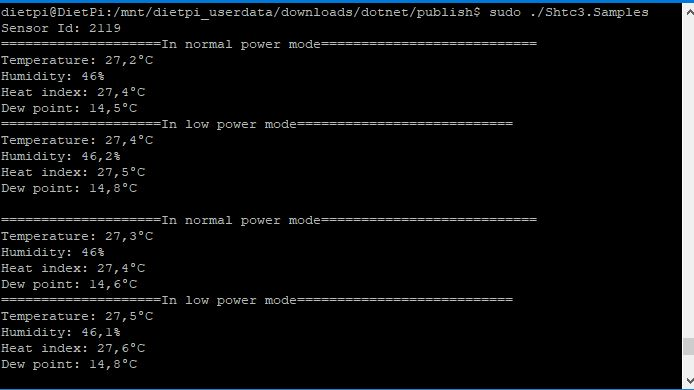

# SHTC3 - Temperature & Humidity Sensor

SHTC3 is a digital humidity and temperature sensor designed especially for battery-driven high-volume consumer electronics application.
To reduce power cosumption this project use capability of sensor to allow measurement in low power mode and active sleep mode.

## Documentation

- SHTC3 [datasheet](https://www.sensirion.com/fileadmin/user_upload/customers/sensirion/Dokumente/2_Humidity_Sensors/Datasheets/Sensirion_Humidity_Sensors_SHTC3_Datasheet.pdf)

## Usage

### Hardware Required

- SHTC3
- Male/Female Jumper Wires

### Circuit

- SCL - SCL
- SDA - SDA
- VCC - 3.3V
- GND - GND

### Code

**Important**: make sure you properly setup the I2C pins especially for ESP32 before creating the `I2cDevice`, make sure you install the `nanoFramework.Hardware.ESP32 nuget`:

```csharp
//////////////////////////////////////////////////////////////////////
// when connecting to an ESP32 device, need to configure the I2C GPIOs
// used for the bus
Configuration.SetPinFunction(21, DeviceFunction.I2C1_DATA);
Configuration.SetPinFunction(22, DeviceFunction.I2C1_CLOCK);
```

For other devices like STM32, please make sure you're using the preset pins for the I2C bus you want to use.

```csharp
I2cConnectionSettings settings = new I2cConnectionSettings(1, Shtc3.DefaultI2cAddress);
I2cDevice device = I2cDevice.Create(settings);

using (Shtc3 sensor = new Shtc3(device))
{
    Debug.WriteLine($"Sensor Id: {sensor.Id}");

    while (true)
    {
            if (sensor.TryGetTemperatureAndHumidity(out var temperature, out var relativeHumidity))
            {
                Debug.WriteLine($"Temperature: {temperature.DegreesCelsius:0.#}\u00B0C");
                Debug.WriteLine($"Relative humidity: {relativeHumidity.Percent:0.#}%");
                // WeatherHelper supports more calculations, such as saturated vapor pressure, actual vapor pressure and absolute humidity.
                Debug.WriteLine($"Heat index: {WeatherHelper.CalculateHeatIndex(temperature, relativeHumidity).DegreesCelsius:0.#}\u00B0C");
                Debug.WriteLine($"Dew point: {WeatherHelper.CalculateDewPoint(temperature, relativeHumidity).DegreesCelsius:0.#}\u00B0C");
                Debug.WriteLine();
            }

        sensor.Sleep();

        Thread.Sleep(1000);
    }

}
```

### Result


