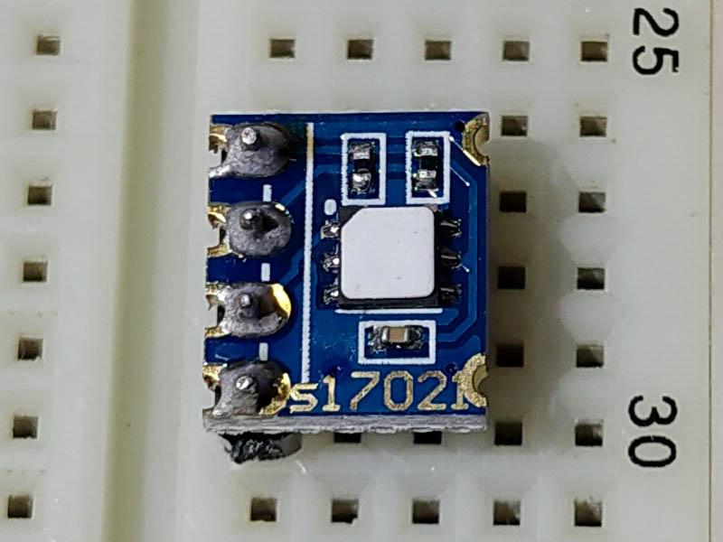
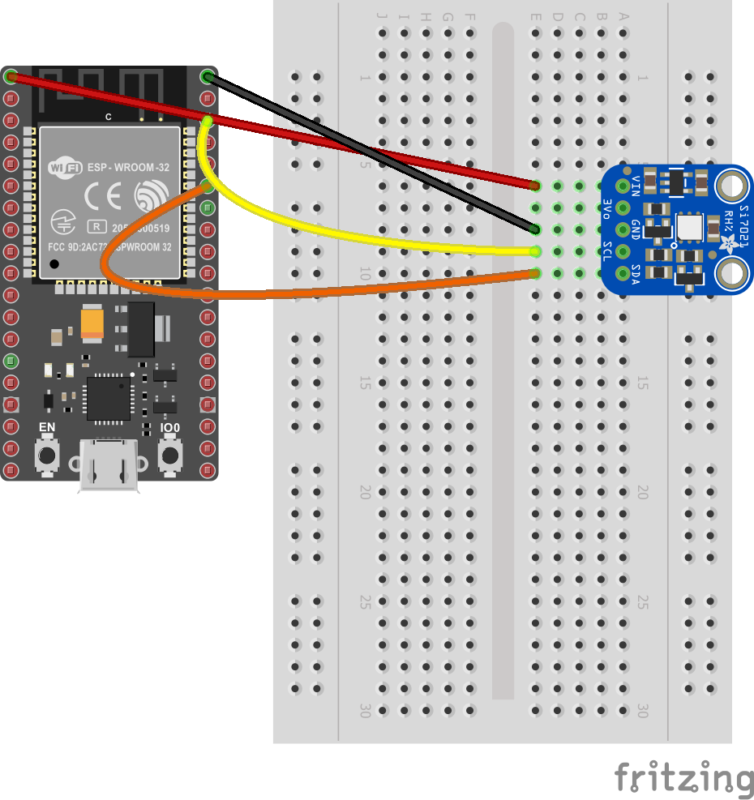
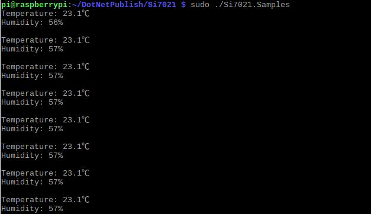

# Si7021 - Temperature & Humidity Sensor

The Si7021 device provides temperature and humidity sensor readings with an I2C interface.

## Documentation

- Si7021 [datasheet](https://cdn.sparkfun.com/datasheets/Sensors/Weather/Si7021.pdf)

## Board




## Usage

**Important**: make sure you properly setup the I2C pins especially for ESP32 before creating the `I2cDevice`, make sure you install the `nanoFramework.Hardware.ESP32 nuget`:

```csharp
//////////////////////////////////////////////////////////////////////
// when connecting to an ESP32 device, need to configure the I2C GPIOs
// used for the bus
Configuration.SetPinFunction(21, DeviceFunction.I2C1_DATA);
Configuration.SetPinFunction(22, DeviceFunction.I2C1_CLOCK);
```

For other devices like STM32, please make sure you're using the preset pins for the I2C bus you want to use.

### Hardware Required

- Si7021
- Male/Female Jumper Wires

### Circuit

- SCL - SCL
- SDA - SDA
- VCC - 5V
- GND - GND

### Code

```csharp
I2cConnectionSettings settings = new I2cConnectionSettings(1, Si7021.DefaultI2cAddress);
I2cDevice device = I2cDevice.Create(settings);

using (Si7021 sensor = new Si7021(device, Resolution.Resolution1))
{
    while (true)
    {
        var tempValue = sensor.Temperature;
        var humValue = sensor.Humidity;

        Debug.WriteLine($"Temperature: {tempValue.Celsius:N2}\u00B0C");
        Debug.WriteLine($"Relative humidity: {humValue:N2}%");

        // WeatherHelper supports more calculations, such as saturated vapor pressure, actual vapor pressure and absolute humidity.
        Debug.WriteLine($"Heat index: {WeatherHelper.CalculateHeatIndex(tempValue, humValue).Celsius:N2}\u00B0C");
        Debug.WriteLine($"Dew point: {WeatherHelper.CalculateDewPoint(tempValue, humValue).Celsius:N2}\u00B0C");
        Debug.WriteLine();

        Thread.Sleep(1000);
    }
}
```

### Result


