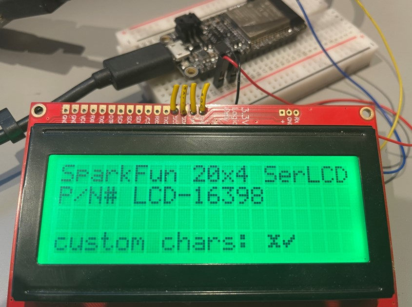

# LCD library for SparkFun RGB Serial Open LCD display (sizes 20x4 or 16x2) with I2C connection

 Use [SparkFunLcd.cs](./SparkFunLcd.cs) to drive SparkFun LCD modules via I2C.
 
 For example product information see [SparkFun LCD-16398](https://www.sparkfun.com/products/16398)
 
 The code contained in this driver is based on see [OpenLCD](https://github.com/sparkfun/OpenLCD)

 ## Usage

For instance the following code writes a simple message to the display,

```csharp
var settings = new I2cConnectionSettings(busId: 1, deviceAddress: SparkFunLcd.DefaultI2cAddress, busSpeed: I2cBusSpeed.StandardMode);
using (var i2cDevice = I2cDevice.Create(settings))
{
    using (var lcd = new SparkFunLcd(i2cDevice, SparkFunLcd.DisplaySizeEnum.Size20x4))
    {
        lcd.SetBacklight(Color.FromArgb(0, 255, 0));
        lcd.SetContrast(4);
        lcd.SetDisplayState(false);
        lcd.Clear();
        lcd.Write(0, 0, "SparkFun 20x4 SerLCD");
        lcd.Write(0, 1, "P/N# LCD-16398");
        lcd.SetDisplayState(true);
    }
}
```

(code validated against Adafruit Huzzah32 Feather)



 ### Custom Characters
 
 - As shown in the photo above custom characters can be defined
 - Up to eight custom characters can be defined numbered 0x0 thru 0x7
 - for information on generating the byte array character bit mask see [link](https://www.quinapalus.com/hd44780udg.html)

```csharp
// demonstrating custom characters
{
    lcd.CreateCustomCharacter(0, new byte[] { 0x0, 0x1b, 0xe, 0x4, 0xe, 0x1b, 0x0, 0x0 }); // define custom character 0x0
    lcd.CreateCustomCharacter(1, new byte[] { 0x0, 0x1, 0x3, 0x16, 0x1c, 0x8, 0x0, 0x0 }); // define custom character 0x1

    lcd.Clear();
    lcd.SetCursorPosition(0, 0);
    lcd.Write(new char[] { '\x0', '\x1' }); // write custom character 0x0 followed by custom character 0x1
}
```

### Important note on use of I2C pins

**Important**: make sure chip pins are properly configured as I2C pins, for instance for ESP32,

```csharp
// configure ESP32 device I2C bus
{
    // note: actual pin-out is specific to Adafruit Huzzah32 Feather on which code was tested
    int dataPin = Gpio.IO23;
    int clockPin = Gpio.IO22;
    Configuration.SetPinFunction(dataPin, DeviceFunction.I2C1_DATA);
    Configuration.SetPinFunction(clockPin, DeviceFunction.I2C1_CLOCK);
}
```
