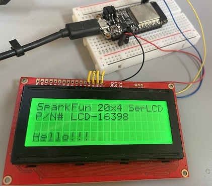

# LCD library for SparkFun RGB Serial Open LCD display (sizes 20x4 or 16x2) with I2C connection

 Use [SparkfunLCD.cs](SparkfunLCD.cs) to drive Sparkfun LCD modules via I2C.
 
 For example product information see [Sparkfun LCD-16398](https://www.sparkfun.com/products/16398)
 
 The code contained in this driver is based on see [OpenLCD](https://github.com/sparkfun/OpenLCD)

 ## Usage

For instance the following code writes a simple message to the display,
```csharp
using (var lcd = new SparkfunLCD(SparkfunLCD.DISPLAYSIZE.SIZE20X4, Gpio.IO23, Gpio.IO22))
{
    lcd.CursorState(false);
    lcd.SetBacklight(0, 255, 0);
    lcd.SetContrast(4);
    lcd.ClearScreen();
    lcd.DisplayState(false);
    lcd.Write(0, 0, "SparkFun 20x4 SerLCD");
    lcd.Write(0, 1, "P/N# LCD-16398");
    lcd.Write(0, 3, "Hello!!!");
    lcd.DisplayState(true);
}
```

(code validated against Adafruit Huzzah32 Feather)



**Important**: make sure you properly setup the I2C pins, this is done automatically for ESP32 when using these constructors by setting `dataPin` and `clockPin` arguments,

```csharp
public SparkfunLCD(DISPLAYSIZE displaySize = DISPLAYSIZE.SIZE20X4, int dataPin = 18, int clockPin = 19);

public SparkfunLCD(DISPLAYSIZE displaySize = DISPLAYSIZE.SIZE20X4, int busId = 1, int deviceAddress = SparkfunLCD.DEFAULTDISPLAYADDRESS, I2cBusSpeed i2cBusSpeed = I2cBusSpeed.StandardMode, int dataPin = 18, int clockPin = 19);

public SparkfunLCD(I2cConnectionSettings settings, DISPLAYSIZE displaySize = DISPLAYSIZE.SIZE20X4, int dataPin = 18, int clockPin = 19);
```


For other chipsets e.g. STM32, it may be necessary to manually set the pin states before utilizing the following constructor,
```csharp
public SparkfunLCD(I2cDevice i2cDevice, DISPLAYSIZE displaySize = DISPLAYSIZE.SIZE20X4)
```
