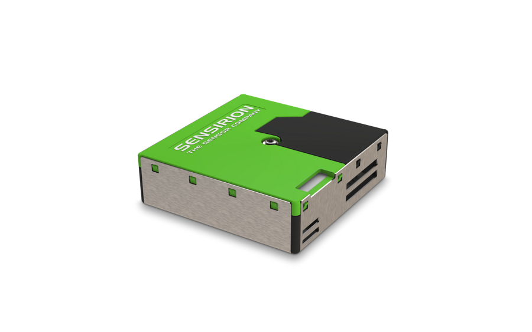

# Sensirion SPS30 Particulate Matter Sensor

This is a library to interact with the Sensirion SPS30 Particulate Matter Sensor. Currently, only the UART interface using the SHDLC protocol is implemented. The SPS30 also supports I2C.



## Documentation

* The datasheet for this sensor can be found [here](https://sensirion.com/media/documents/8600FF88/616542B5/Sensirion_PM_Sensors_Datasheet_SPS30.pdf)

## Usage for the UART interface

**Important**: make sure you properly setup the UART pins for ESP32 before creating the `SerialPort`. For this, make sure you install the `nanoFramework.Hardware.Esp32` NuGet and use the `Configuration` class to configure the pins:

```csharp
Configuration.SetPinFunction(4, DeviceFunction.COM2_TX);
Configuration.SetPinFunction(15, DeviceFunction.COM2_RX);
```

Initialize the `SerialPort`, wrap it in the `ShdlcProtocol`, then pass to the `Sps30Sensor`:

```csharp
var serial = new SerialPort("COM2", 115200, Parity.None, 8, StopBits.One);
var shdlc = new ShdlcProtocol(serial, timeoutInMillis: 10000);
var sps30 = new Sps30Sensor(shdlc);
```

Use the `sps30` to interact with the sensor, e.g.:

```csharp
var version = sps30.ReadVersion();
Debug.WriteLine($"SPS30 detected: {version}");
```

Collect a measurement reliably:

```csharp
try { sps30.StopMeasurement(); } catch { } // In case already measuring from a previous run
sps30.StartMeasurement(MeasurementOutputFormat.Float);
Thread.Sleep(5000); // SPS30 requires some time before it can sample data
var measurement = sps30.ReadMeasuredValues();
Debug.WriteLine($"Measurement: {measurement}");
```

The above would output the following:

```text
SPS30 detected: ID=00080000, serial=4E1AD1BB796C64C5, version=Firmware V2.1, Hardware V7, SHDLC V2.0, status=RawRegister: 0, FanSpeedOutOfRange: False, LaserFailure: False, FanFailureBlockedOrBroken: False, cleaninginterval=604800
Measurement: MassConcentration [µg/m³] PM1.0=2.00064229965, PM2.5=5.78215932, PM4.0=8.74958038, PM10.0=9.3430643, NumberConcentration [#/cm³] PM0.5=5.54537582, PM1.0=12.034433364, PM2.5=15.72880268, PM4.0=16.44550895, PM10.0=16.58645629, TypicalParticleSize[nm]=675.40591955
```

Check out the sample for more information.

