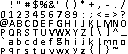
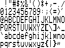
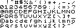
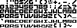
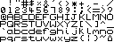
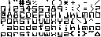
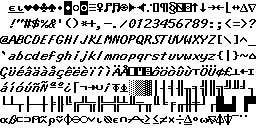

# SSD1306 sample fonts

Here are sample fonts generated by Bitmap2Font from bitmaps available [here](http://www.orangetide.com/fonts/DOS/).

Each font is constituted by a C# class which needs to be added to your project. You can add them to the sample project and see how the behavior is changing.

Each font is associated with a bitmap to display its complete character set. The bitmap has been added to this repository for convenience.

| Font name | Bitmaps |
|---|---|
|mykefont8x9||
|Retro8x16||
|Sinclair8x8||
|Thick8x8||
|Thin8x8||
|Westminster8x8||
|lbitalic16||
