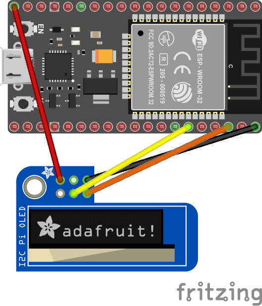
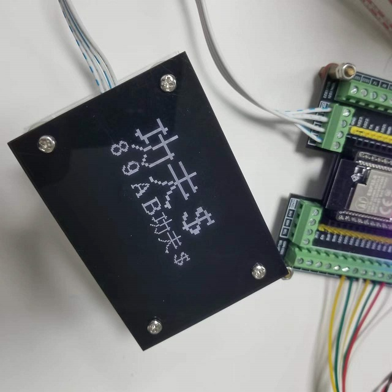

# SSD13xx/SSD1306/SSD1327 & SSH1106 - OLED display family

The SSD1306/SSH1106 are a single-chip CMOS OLED/PLED driver with controllers for organic/polymer light emitting diode dot-matrix graphic display system. It consists of 128 segments and 64 commons. This IC is designed for Common Cathode type OLED panel.

## Documentation

- IoT NanoFramework SSD1306/SSH1106 [Driver](https://github.com/nanoframework/nanoFramework.IoT.Device)
- SSD1306 [datasheet](https://cdn-shop.adafruit.com/datasheets/SSD1306.pdf)
- SSD1327 [datasheet](https://github.com/SeeedDocument/Grove_OLED_1.12/raw/master/resources/SSD1327_datasheet.pdf)

### Related Devices

- [Adafruit PiOLED - 128x32 Monochrome OLED Add-on for Raspberry Pi](https://www.adafruit.com/product/3527)
- [HiLetgo 1.3" SPI 128x64 SSH1106 OLED LCD Display LCD](https://www.amazon.com/HiLetgo-128x64-SSH1106-Display-Arduino/dp/B01N1LZT8L/ref=sr_1_2?crid=C88G1YX0AN3Q&dchild=1&keywords=ssh1106&qid=1634064423&sr=8-2)
- [SunFounder 0.96" Inch Blue I2C IIC Serial 128x64 OLED LCD LED SSD1306 Modul](https://www.amazon.com/SunFounder-SSD1306-Arduino-Raspberry-Display/dp/B014KUB1SA)
- [Diymall 0.96" Inch Blue and Yellow I2c IIC Serial Oled LCD LED Module 12864 128X64 for Arduino Display Raspberry PI 51 Msp420 Stim32 SCR](https://www.amazon.com/Diymall-Yellow-Arduino-Display-Raspberry/dp/B00O2LLT30)

## Board

Address on the I2C bus: Ssd1306.DefaultI2cAddress 0x3C



Version with 7-pin I2C/SPI

Address on the I2C bus: Ssd1306.SecondaryI2cAddress 0x3D

Connecting resistors:

- I2C — R1, R4, R8;
- SPI — R3, R4.

For only I2C


### Connection table

| Pin No: | Pin Name: | Description: |
| ------------ | ------------ | ------------ |
| 1 | Ground (Gnd) | Connected to the ground of the circuit |
| 2 | Supply (Vdd,Vcc,5V) | Can be powered by either 3.3V or 5V |
| 3 | SCK (D0,SCL,CLK) | The display supports both IIC and SPI, for which clock is supplied through this pin |
| 4 | SDA (D1,MOSI) | This is the data pin of the both, it can either be used for IIC or for SPI |
| 5 | RES(RST,RESET) | When held to ground momentarily this pin resets the module (operational work, High value) |
| 6 | DC (A0) | I2C — must be connected to power (3.3V or 5V). SPI — this is command pin |
| 7 | Chip Select (CS) | Normally held low, used only when more than one SPI device is connected to MCU |

## Binding Notes

This binding currently only supports commands and raw data.  Eventually, the plan is to create a graphics library that can send text and images to the device. So this library is just a start and you'll find in the [sample](./samples) more advance commands.

The following connection types are supported by this binding.

- [X] I2C
- [ ] SPI

## Usage notes

There are two groups of drawing methods.

1. Various specialized drawing methods allowing to draw on screen pixel-by-pixel, like:
    - ````DrawPixel(...)````: draws one pixel
    - ````DrawHorizontalLine(...)````: draws a horizontal line
    - ````DrawVerticalLine(...)````: draws a vertical line
    - ````DrawFilledRectangle(...)````: draws a filled rectangle
    - ````DrawBitmap(...)````: draws a bitmap
    - ````DrawString(...)````: draws a string with preset font

    Using these methods you do not need to care about any technique the driver uses to display your drawing instructions.

2. Methods allowing to modify screen content by blocks of internal representation (screen buffer), like:
    - ````DrawDirectAligned(...)````: overwrites screen buffer with given content
    - ````ClearDirectAligned(...)````: clears out (with 0x00) given part of screen buffer

    These methods allow faster (~100 times) display access but with some constraints.
    - bitmaps handed over here must be in appropriate format (see SSD13xx docs for "GDDRAM" and "Horizontal addressing mode").
    - no bit operations occure with existing buffer data (with pixels drawn via other means), the new data will overwrite the pixels "below" newly drawed content.
    - the "y" coordinate and the bitmap height must be byte aligned with screen buffer (again, see above docs)

The use of two groups can be freely mixed (e.g. display text via ````DrawString(...)```` and displaying an image below via ````DrawDirectAligned(...)````)

Examples for 1. can be found in ````samples```` folder.

Example for 2. follows here.

````csharp
// There are superb online helpers like the one below which are able to
// create an appropriate byte array from an image in code use ready format.
// https://www.mischianti.org/images-to-byte-array-online-converter-cpp-arduino/
// On the site above use these settings to get bytes needed here:
// - "plain bytes"
// - "vertical - 1 bit per pixel"
var buffer = new byte[] { ... }; 
var width = 16;
var height = 16;

// instantiation example
var ssd1306 = new Ssd1306(
    I2cDevice.Create(
        new I2cConnectionSettings(
            1, 
            Ssd1306.DefaultI2cAddress, 
            I2cBusSpeed.FastMode)), 
    Ssd13xx.DisplayResolution.OLED128x64);

// this line sends the image data to the screen
ssd1306.DrawDirectAligned(x, y, width, height, buffer);

// this one wipes its place to blank
ssd1306.ClearDirectAligned(x, y, width, height);

````

To display double byte fonts (for example fonts of Asian languages) you have to set the font to `DoubleByteFont()`, like this:

```csharp
device.Font = new DoubleByteFont();
device.DrawString(2, 2, "功夫＄", 2, false);
device.DrawString(2, 34, "８９ＡＢ功夫＄", 1, true);
device.Display();
```

Follows the output on the display:



## Fonts

Fonts can be used following the [IFont](./IFont.cs) implementation.

Sample fonts are provided both in the [sample directory](./samples/) and in the [additional font one](./Additionnal_Fonts/). A tool called `Bitmap2Font` is also provided helping to automatically generate the Font class. In short, it can take any black and white image of fixed size font and generate the Font class. More [information here](./Bitmap2Font/).

## IotByteFont: .NET Dot Matrix Font Creator Tool

IotByteFont is a .NET dot matrix font creation tool. It can load your favorite font files and generate custom dot matrix font code.

### Installation

You can install the IotByteFont tool with the following command:

```bash
dotnet tool install -g IotByteFont
```

### Usage

Here are the command-line options for the IotByteFont tool:

| Option | Default Value | Description |
| ------ | ------------- | ----------- |
| -f, --font | Microsoft YaHei UI | Font file path or font name. |
| -c, --char | chars.txt | Char file path or char string. |
| -s, --size | 16 | Font size. |
| -w, --width | 0 | Font width. 0 means same as font size. |
| -y, --yoffset | 0.75 | Font y offset. size * y. Not recommended to adjust. Adjust with debug mode. |
| -t, --threshold | 128 | Threshold for binarization. |
| -n, --name | IotByteFont | Output class name. |
| -d, --debug | false | Debug mode. Print debug info and bitmap. |

### Example

When creating a font, you need to specify the font file or font name, the characters to include in the font, and the size of the font. You can also specify the width of the font, the y offset, and the name of the output class. Turning on debug mode can print debug information and the final font bitmap.

```bash
IotByteFont --char "abcde功夫＄" --size 8
IotByteFont --font ms.ttf --char chars.txt --yoffset 0.6 --name MyFont --debug
```
