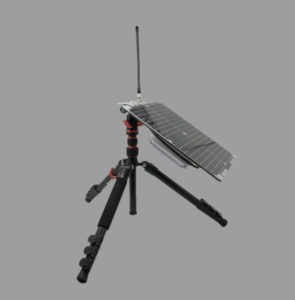
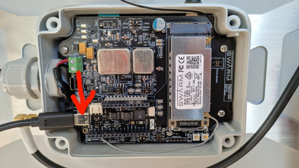

# Swarm Tile

This library allows using all the features of the satellite module from [Swarm](https://swarm.space/).


## Documentation

- Swarm Tile [datasheet](https://swarm.space/wp-content/uploads/2020/10/Swarm-Tile-Spec-Sheet.pdf)
- Swarm Tile Product Manual [datasheet](https://swarm.space/wp-content/uploads/2021/11/Swarm-Tile-Product-Manual.pdf)
- Swarm Evaluation Kit Guide [datasheet](https://swarm.space/wp-content/uploads/2021/09/Swarm-Eval-Kit-Quickstart-Guide.pdf)

## Usage

### Hardware Required

- Swarm Evaluation Kit



The Swarm Evaluation Kit contains a [Feather S2](https://feathers2.io/) module inside. The code described here (and in the sample application) is based on this hardware. If you're using the library with another nanoFramework module and/or connected to your Swarm Tile you may have to adjust the COM port where it's connected.

The Feather S2 module is connected to Visual Studio using an USB cable like this.


For a smoother experience it's recommended that you follow the instructions on Swarm Evaluation Kit guide on how to properly setup the Kit.

### Setup the device in a C# application

You just need to instantiate the `SwarmTile` object and pass the COM port where it's connected to.
On the code snippet bellow that's what's happening along with a event being awaited for the device to become ready.

```csharp
// The COM port where the Tile is connected to
// Using COM1 for the Swarm Evaluation Kit
var swarmTile = new SwarmTile("COM1");

// wait 5 seconds for the Tile to become operational
if (!swarmTile.DeviceReady.WaitOne(5_000, false))
{
    /////////////////////////
    // Tile is not responsive
    /////////////////////////

    Debug.WriteLine("****************************************************************");
    Debug.WriteLine("*** TILE IS NOT RESPONSIVE, POSSIBLY POWERED OFF OR SLEEPING ***");
    Debug.WriteLine("****************************************************************");
}
else
{
    // output device IDs
    Debug.WriteLine($"DeviceID: {swarmTile.DeviceID}");
    Debug.WriteLine($"DeviceName: {swarmTile.DeviceName}");
}
```

### Sending a message

Composing and queuing up a message for transmission requires only a few lines  of code.

```csharp
// transmit a message to the Swarm network
MessageToTransmit message = new MessageToTransmit("Hello from .NET nanoFramework!");

// send message
string msgId;

if (swarmTile.TryToSendMessage(message, out msgId))
{
    Debug.WriteLine($"Message {msgId} waiting to be transmitted!");
}
else
{
    Debug.WriteLine($"Failed to send message. Error: {swarmTile.LastErrorMessage}.");
}
```

### Handling events

The library offers several events to allow using it in a "reactive" fashion. With those one doesn't have to worry about asynchronous events or keep pooling for updates or state changes.

To get notified on a message event (transmitted, expired or received) just add the handler, like this:

```csharp
// setup handler for message events
swarmTile.MessageEvent += SwarmTile_MessageReceived;
```

And add code to process the event.

```csharp
private static void SwarmTile_MessageEvent(MessageEvent messageEvent, string messageId)
{
    switch(messageEvent)
    {
        case MessageEvent.Expired:
            Debug.WriteLine($"Message {messageId} expired without being transmitted.");
            break;

        case MessageEvent.Sent:
            Debug.WriteLine($"Message {messageId} has been successfully transmitted.");
            break;

        case MessageEvent.Received:
            Debug.WriteLine($"Just received message {messageId}.");
            break;

    }
}
```

There are other events available, like power state change, date and time updated, background noise reading, geospatial information and tile status.

### Controlling power mode

The Swarm Tile allows controlling the power state of the device to better manage power usage.

To completely power off the device, call this `swarmTile.PowerOff()`.

To have the Tile go into sleep for 60 minutes and wake-up again: `swarmTile.SendToSleep(60 * 60)`.
Upon wake-up a `PowerStateChanged` event is raised.

### Managing messages

To manage messages the Swarm Tile has a local database with two tables: one for messages waiting to be transmitted and another for received messages.
Those tables can be queried, read from and items deleted. The `SwarmTile` expose those as two properties, respectively: `MessagesToTransmit` and `MessagesReceived`.

Available operations to `MessagesToTransmit` table:

- List all messages: `GetAllMessages()`.
- List a specific message: `GetMessage(id)`.
- Delete all messages: `DeleteAllMessages()`.
- Delete a specific message: `DeleteMessage(id)`.
- Number of messages in the table: `Count` property.

Available operations to `MessagesReceived` table:

- List all messages: `GetAllMessages()`.
- List a specific message: `GetMessage(id)`.
- Read a specific message: `ReadMessage(id)`.
- Read the newest received message: `ReadNewestMessage()`.
- Read the oldest message received: `ReadOldestMessage()`.
- Mark a message as read: `MarkMessageRead(id)`.
- Mark all messages as read: `MarkAllMessagesRead()`.
- Delete all messages: `DeleteAllMessages()`.
- Delete all messages that have been read: `DeleteAllReadMessages()`.
- Delete a specific message: `DeleteMessage(id)`.
- Number of messages in the table: `Count` property.
- Number of unread messages in the table: `UnreadCount` property.
