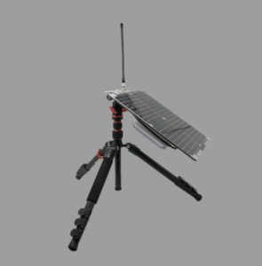

# Swarm Tile

This library allows using all the features of the satellite module from [Swarm](https://swarm.space/).


## Documentation

- Swarm Tile [datasheet](https://swarm.space/wp-content/uploads/2020/10/Swarm-Tile-Spec-Sheet.pdf)
- Swarm Tile Product Manual [datasheet](https://swarm.space/wp-content/uploads/2021/11/Swarm-Tile-Product-Manual.pdf)
- Swarm Evaluation Kit Guide [datasheet](https://swarm.space/wp-content/uploads/2021/09/Swarm-Eval-Kit-Quickstart-Guide.pdf)

## Usage

### Hardware Required

- Swarm Evaluation Kit



The Swarm Evaluation Kit contains a [Feather S2](https://feathers2.io/) module inside. The code described here (and in the sample application) is based on this hardware. If you're using the library with another nanoFramework module and/or connected to your Swarm Tile you may have to adjust the COM port where it's connected.

For a smoother experience it's recommended that you follow the instructions on Swarm Evaluation Kit guide on how to properly setup the Kit.

### Setup the device in a C# application

You just need to instantiate the `SwarmTile` object and pass the COM port where it's connected to.
On the code snippet bellow that's what's happening along with displaying the device IDs and queueing up a message for transmition.

```csharp

// The COM port where the Tile is connected to
// Using COM1 for the Swarm Evaluation Kit
var swarmTile = new SwarmTile("COM1");

// let it settle for a couple of seconds
Thread.Sleep(5_000);

// output device IDs
Debug.WriteLine($"DeviceID: {swarmTile.DeviceID}");
Debug.WriteLine($"DeviceName: {swarmTile.DeviceName}");

// transmit a message to the Swarm network
MessageToTransmit message = new MessageToTransmit("Hello from .NET nanoFramework!");
var msgId = swarmTile.TransmitData(message);

Debug.WriteLine($"Message {msgId} waiting to be transmitted!");

```

### Adding event handlers

You just need to instantiate the `SwarmTile` object and pass the COM port where it's connected to.
On the code snippet bellow that's what's happening along with displaying the device IDs and queueing up a message for transmition.

```csharp

// The COM port where the Tile is connected to
// Using COM1 for the Swarm Evaluation Kit
var swarmTile = new SwarmTile("COM1");

// let it settle for a couple of seconds
Thread.Sleep(5_000);

// output device IDs
Debug.WriteLine($"DeviceID: {swarmTile.DeviceID}");
Debug.WriteLine($"DeviceName: {swarmTile.DeviceName}");

// transmit a message to the Swarm network
MessageToTransmit message = new MessageToTransmit("Hello from .NET nanoFramework!");
var msgId = swarmTile.TransmitData(message);

Debug.WriteLine($"Message {msgId} waiting to be transmitted!");

```

